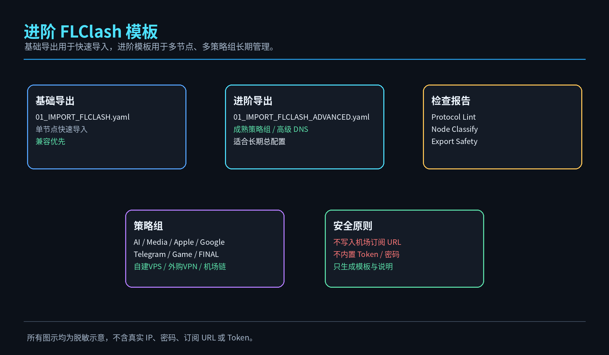

# LazyVPS Quick Menu Pack / 懒人建 VPS 快速菜单包

<p align="center">
  
</p>

<p align="center">
  <b>少折腾 · 快部署 · 可回滚 · 可分享 · 支持 VLESS Reality Vision 与进阶 FLClash 模板</b>
</p>

<p align="center">
  
  
  
  
</p>

---

## 你想做什么？先看这里

| 需求 | 直接看哪一段 | 适合场景 |
|---|---|---|
| 新 VPS 快速建站 / 建节点 | 一、新 VPS 快速建站流程 | 新买 VPS，要快速部署 Trojan / VLESS Reality / Hysteria2 |
| VLESS Reality Vision | 二、VLESS Reality Vision 支持 | 想用更现代的 VLESS Reality Vision 模板 |
| 进阶 FLClash 总配置 | 三、进阶 FLClash 导出模板 | 需要成熟策略组、高级 DNS、AI/媒体分类 |
| 节点命名与分类 | 四、节点命名与分类整理 | 自建 VPS、外购 VPN、机场节点越来越多 |
| 协议导出体检 | 五、协议导出体检 | 检查 VLESS/Trojan/Hysteria2 缺字段、重复名、策略组引用 |
| AI / 媒体解锁 | 六、服务端 AI 分流、Media DNS、机场链 | 香港入口 + 日本小鸡 / Zouter DNS / 外购机场链 |

---

# 一、新 VPS 快速建站流程

```bash
wget -O lazy-vps-menu.sh https://raw.githubusercontent.com/souldance7-ai/VPS-/main/lazy-vps-menu.sh
chmod +x lazy-vps-menu.sh
bash lazy-vps-menu.sh
```

推荐流程：

```text
1) System Init
2) Stable BBR
3) Firewall Backend
4) Xray Core
5) Trojan 443 或 6) VLESS Reality Vision
8) Status
10) Export
41) Advanced Export
44) Protocol Lint
```

---

# 二、VLESS Reality Vision 支持

v1.2.4 将原本 Reality 功能明确升级为：

```text
6) VLESS Reality Vision / 部署 VLESS-R 协议
```

核心字段：

```yaml
type: vless
tls: true
flow: xtls-rprx-vision
servername: www.microsoft.com
reality-opts:
  public-key: <public-key>
  short-id: <short-id>
client-fingerprint: chrome
```

<p align="center">
  
</p>

说明：

- 适合新版 Mihomo / FLClash。
- 若导入后 Timeout，先运行 `44) Protocol Lint` 检查字段。
- Surge 对 VLESS Reality 支持受版本影响，建议以 FLClash / Mihomo 为主测试。

---

# 三、进阶 FLClash 导出模板

基础导出仍然是：

```text
10) Export / 导出配置包
```

v1.2.4 新增：

```text
41) Advanced Export / 进阶 FLClash 导出
```

会生成：

```text
/opt/lazy-vps-menu/outputs/01_IMPORT_FLCLASH_ADVANCED.yaml
```

<p align="center">
  
</p>

进阶模板包含：

- fake-ip-filter
- fallback DNS / fallback-filter
- AUTO / AI / 流媒体 / Apple / Google / Microsoft / Telegram / Game / FINAL
- 自建 VPS / 外购 VPN / 机场链策略组
- Media DNS 自动同步

---

# 四、节点命名与分类整理

新增：

```text
43) Node Classify / 节点分类命名整理
```

会输出：

```text
/opt/lazy-vps-menu/reports/node_classify_时间.csv
/opt/lazy-vps-menu/reports/node_classify_时间.md
```

推荐命名：

```text
自建 VPS：
🇭🇰 香港-Zouter-T协议
🇯🇵 日本-光维云01-T协议

外购 VPN：
🇯🇵-VK-纯度10%-JP-SH-11
🇹🇼-wget企业-纯度15%-台湾02

机场节点：
🇭🇰 HK-Optim-01-VLESS
🇯🇵 JP-Optim-01-VLESS
```

---

# 五、协议导出体检

新增：

```text
44) Protocol Lint / 协议导出体检
```

检查内容：

| 协议 | 检查字段 |
|---|---|
| VLESS Reality | uuid / tls / flow / servername / public-key / short-id / client-fingerprint |
| Trojan | server / port / password / sni |
| Hysteria2 | server / port / password / sni |
| 通用 | 节点名重复、字段为空、YAML 解析失败 |

---

# 六、服务端 AI 分流、Media DNS、机场链

保留原有：

```text
22) Server AI Routing / 服务端AI分流
30) DNS Unlock / 媒体 DNS 解锁与导出同步
40) Airport Chain Template / 机场链规则模板
42) Strategy Template / 成熟策略组模板
```

三种方式区别：

| 方式 | 解决什么 | 出口是否改变 |
|---|---|---|
| Server AI Routing | 香港入口不能 GPT，把 AI 域名转到日本/台湾小鸡 | AI 出口会变 |
| Media DNS Unlock | 流媒体 DNS / CDN 解析错误 | 出口 IP 不一定变 |
| Airport Chain | AI / 媒体走外购机场策略组或纯净节点 | 指定域名出口会变 |

---

# 七、菜单编号变化

v1.2.4 新增：

```text
41) Advanced Export / 进阶 FLClash 导出
42) Strategy Template / 成熟策略组模板
43) Node Classify / 节点分类命名整理
44) Protocol Lint / 协议导出体检
45) VLESS Vision Guide / VLESS Reality Vision 说明
46) Exit / 退出
```

快速命令：

```bash
bash /root/lazy-vps-menu.sh --quick advanced-export
bash /root/lazy-vps-menu.sh --quick strategy-template
bash /root/lazy-vps-menu.sh --quick node-classify
bash /root/lazy-vps-menu.sh --quick protocol-lint
bash /root/lazy-vps-menu.sh --quick vless-guide
```

---

## 分享安全

本项目不内置以下敏感信息：

```text
VPS IP
私有域名
Trojan / Hysteria2 密码
机场订阅 URL / Token
Cloudflare Token
SSH 登录信息
```

所有 README 示意图均为脱敏示意图，不包含真实 IP、password、pinnedPeerCertSha256 或机场订阅信息。

---

## License

MIT License
