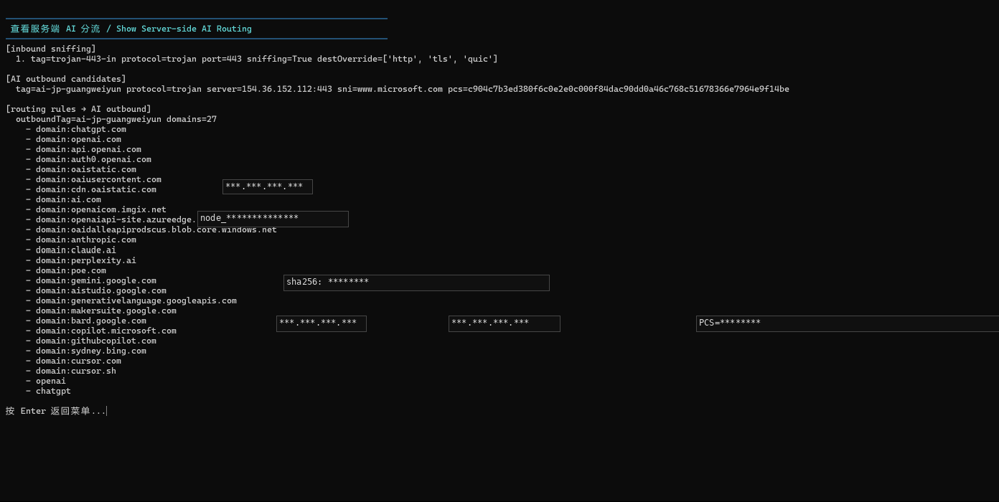
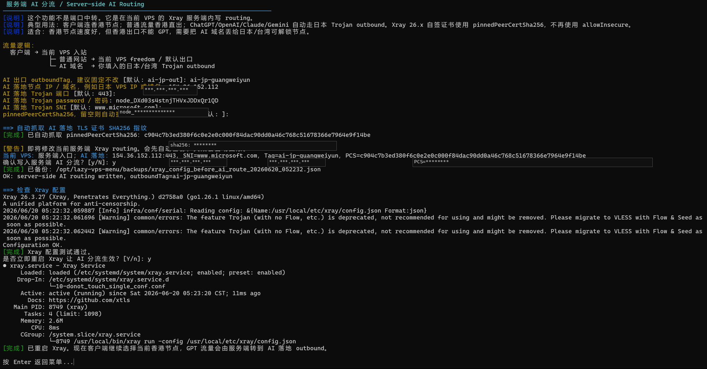
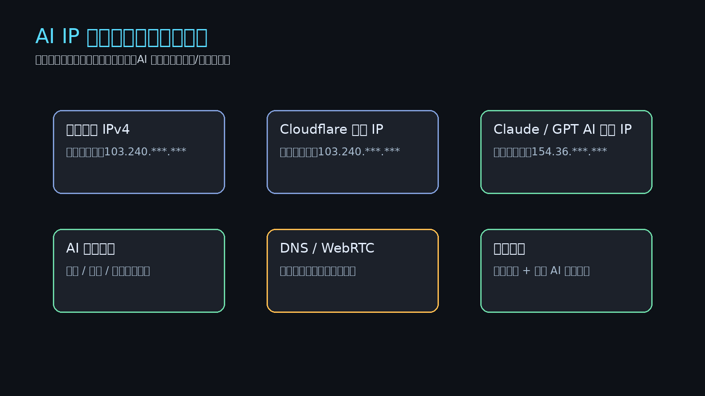

# LazyVPS Quick Menu Pack / 懒人建 VPS 快速菜单包

<p align="center">
  
</p>

<p align="center">
  <b>少折腾 · 快部署 · 可回滚 · 可分享 · 支持服务端 AI 分流</b>
</p>

<p align="center">
  
  
  
  
</p>

---

## 快速使用

一键下载并运行：

```bash
wget -O lazy-vps-menu.sh https://raw.githubusercontent.com/souldance7-ai/VPS-/main/lazy-vps-menu.sh
chmod +x lazy-vps-menu.sh
bash lazy-vps-menu.sh
```

一行命令：

```bash
wget -O lazy-vps-menu.sh https://raw.githubusercontent.com/souldance7-ai/VPS-/main/lazy-vps-menu.sh && chmod +x lazy-vps-menu.sh && bash lazy-vps-menu.sh
```

仅预览界面：

```bash
bash lazy-vps-menu.sh --preview
```

---

## v1.2 更新重点：服务端 AI 分流

v1.2 把 **端口中转** 和 **服务端 AI 域名分流** 拆开，避免新手把两个功能混在一起。

### 适用场景

例如：

```text
香港 VPS 速度很好，但香港出口不能直接使用 GPT / Claude。
希望：
普通网站       → 继续走香港出口
GPT / OpenAI  → 由香港服务端自动转交日本 / 台湾落地节点
```

### 正确逻辑

```text
客户端 → 香港 VPS Xray inbound
          ├─ 普通网站 → 当前 VPS freedom / 默认出口
          └─ AI 域名 → 日本 / 台湾 Trojan outbound
```

> 这不是端口中转，不是把整台香港节点全部转发到日本；它是 Xray 服务端 routing 的域名分流。

---

## v1.2 菜单变化

| 菜单 | 功能 | 使用场景 |
|---|---|---|
| `21) Client AI Rules` | 客户端 AI 规则模板 | 只改客户端规则 |
| `22) Server AI Routing` | 服务端 AI 分流 | 香港节点要 GPT，AI 域名走日本/台湾出口 |
| `23) AI Route Show` | 查看服务端 AI 分流 | 确认 sniffing、outbound、routing 是否写入 |
| `24) AI Route Rollback` | 回滚服务端 AI 分流 | 写错或失效时恢复备份 |
| `25) Relay Forward` | 端口中转规则 | 整个入口端口转发到后端 |
| `26) Relay Client` | 端口中转客户端 | 生成中转客户端配置 |
| `27) Relay Show` | 查看端口中转 | 检查中转规则 |
| `28) Relay Clear` | 清空端口中转 | 清理中转规则 |

---

## 服务端 AI 分流操作步骤

### 1. 脚本放在“入口 VPS”上执行

如果你要让香港节点可以用 GPT，就把 v1.2 脚本放到 **香港 VPS** 上执行，不是在日本 VPS 上执行。

```bash
chmod +x /root/lazy-vps-menu.sh
bash /root/lazy-vps-menu.sh
```

### 2. 进入菜单 22

```text
22) Server AI Routing / 服务端AI分流
```

### 3. 按提示填写 AI 落地节点

以日本 Trojan 节点为例：

```text
AI 出口 outboundTag：
ai-jp-guangweiyun

AI 落地节点 IP / 域名：
***.***.***.***

AI 落地 Trojan 端口：
443

AI 落地 Trojan password：
node_**************

AI 落地 Trojan SNI：
www.microsoft.com

pinnedPeerCertSha256：
直接留空，让脚本自动抓取
```

### 4. 确认写入

脚本会自动：

```text
1. 备份当前 Xray 配置
2. 开启 inbound sniffing
3. 新增日本 / 台湾 Trojan outbound
4. 写入 ChatGPT / OpenAI / Claude / Gemini 等 AI 域名路由
5. 自动抓取 pinnedPeerCertSha256
6. 检查 Xray 配置
7. 通过后询问是否重启 Xray
```

如果出现配置错误，会自动回滚。

### 5. 重启 Xray 生效

看到：

```text
Configuration OK.
[完成] Xray 配置测试通过。
是否立即重启 Xray 让 AI 分流生效？[Y/n]:
```

输入：

```text
y
```

---

## 服务端 AI 分流执行截图

### 写入前填写落地节点

<p align="center">
  
</p>

### 写入成功并重启 Xray

<p align="center">
  
</p>

### AI IP 检测示意

<p align="center">
  
</p>

> 图片已脱敏，IP、password、证书指纹均已遮蔽。

---

## 如何确认成功

### 1. 查看服务端 AI 分流

菜单选择：

```text
23) AI Route Show / 查看服务端AI分流
```

或执行：

```bash
bash /root/lazy-vps-menu.sh --quick ai-route-show
```

应该看到：

```text
sniffing=True
tag=ai-jp-xxxx
protocol=trojan
server=***.***.***.***:443
sni=www.microsoft.com
pinnedPeerCertSha256=********
routing rules → AI outbound
```

### 2. 客户端仍然选香港节点

FLClash / Surge / Shadowrocket 仍然选择：

```text
香港入口节点
```

不要选日本。

### 3. 访问 AI IP 检测网站

建议连上香港节点后访问：

```text
https://ip.net.coffee/claude/
```

正常现象：

```text
中国出口 / 普通出口：香港
Claude / GPT AI 出口：日本 / 台湾落地
```

如果 AI 出口变成日本 / 台湾，说明服务端 AI 分流已经生效。

---

## 常见误区

### 误区 1：用端口中转解决 GPT

错误理解：

```text
香港端口 → 日本 IP
```

这个是端口中转，不适合“普通网站走香港、AI 域名走日本”的场景。

正确方式：

```text
Server AI Routing：香港 Xray routing 按域名把 AI 流量转给日本 outbound
```

### 误区 2：用 ipinfo.io 判断是否成功

`ipinfo.io` 检测的是普通出口。  
服务端 AI 分流成功后，普通出口仍可能是香港，这是正常的。

请用 AI 检测网站判断 AI 出口。

### 误区 3：Xray 26.x 继续使用 allowInsecure

Xray 26.x 自签证书场景不再建议使用 `allowInsecure`。  
本版本使用 `pinnedPeerCertSha256`，留空时脚本自动抓取落地节点证书 SHA256 指纹。

---

## 发生异常怎么办

### 配置测试失败

脚本会自动回滚备份，不会直接把原服务写坏。

### 查看 Xray 状态

```bash
systemctl status xray --no-pager
```

### 查看 Xray 日志

```bash
journalctl -u xray -n 80 --no-pager
```

### 回滚服务端 AI 分流

菜单选择：

```text
24) AI Route Rollback / 回滚服务端AI分流
```

或执行：

```bash
bash /root/lazy-vps-menu.sh --quick ai-route-rollback
```

---

## 功能亮点

| 功能区 | 说明 |
|---|---|
| BASIC 基础环境 | 系统初始化、BBR、防火墙后端、Xray Core |
| PROTOCOL 协议部署 | Trojan 443、Reality 443、Hysteria2 8443 |
| CHECK 检查导出 | 状态检查、节点输出、配置导出 |
| BACKUP 备份服务 | 当前配置备份、Xray / Hysteria2 回滚、停止服务 |
| DOWNLOAD 下载合并 | HTTP 下载、NodeQuality、配置合并 |
| RELAY 分流中转 | 客户端规则、服务端 AI 分流、端口中转 |
| TUNE 调优诊断 | BBRv3、DNS 解锁、TCP 调优、诊断修复 |

---

## 操作方式

```text
↑ / ↓ 选择功能
← / → 切换分区
Enter 执行
1-32 直达功能
Q 退出
```

---

## 分享安全

本项目不内置以下敏感信息：

```text
VPS IP
私有域名
Trojan / Hysteria2 密码
订阅地址
Cloudflare Token
SSH 登录信息
```

截图与文档中的 IP、password、证书指纹均已脱敏处理。

---

## License

MIT License
