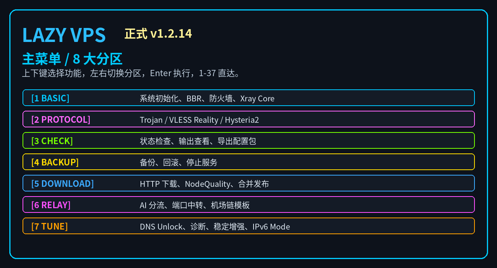
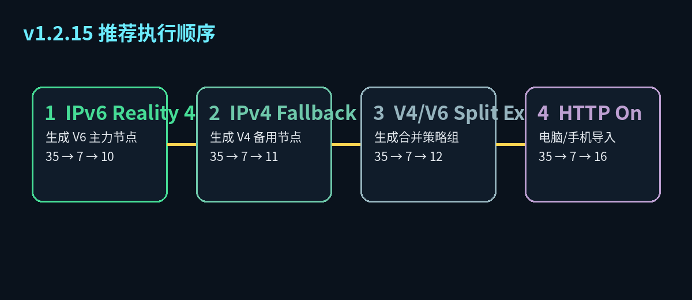
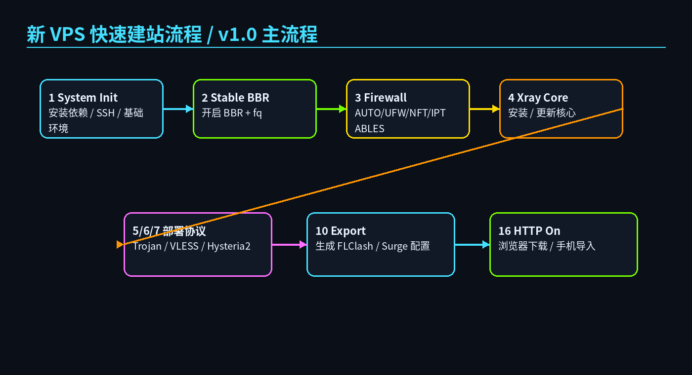
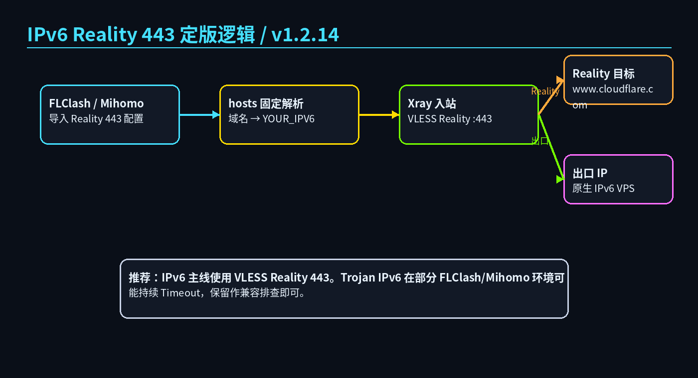
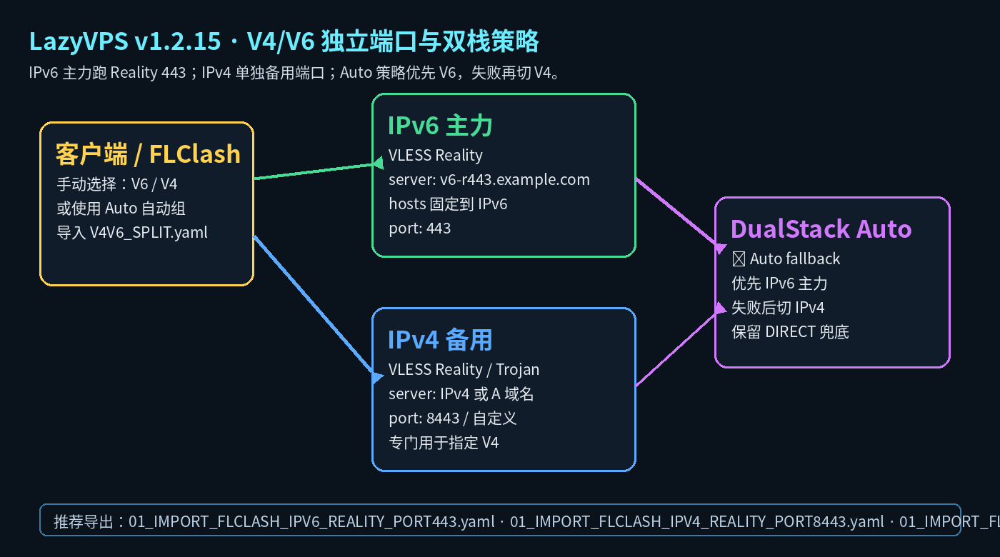
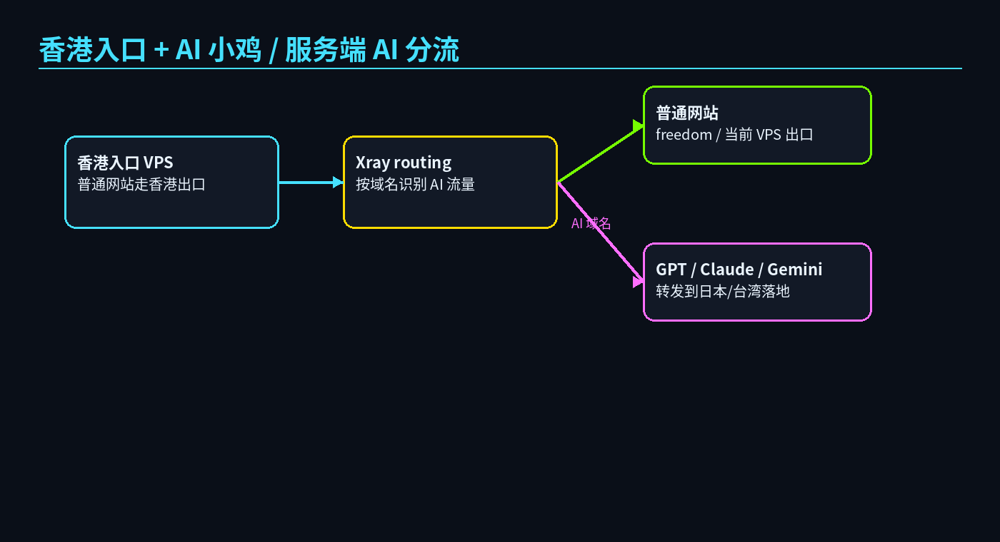
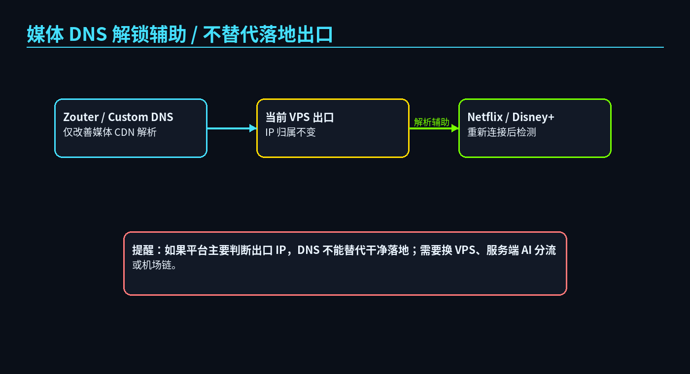
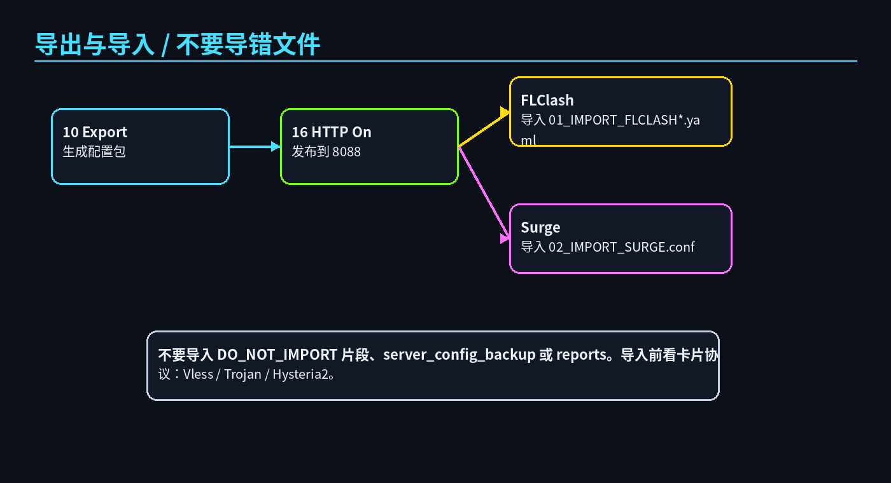
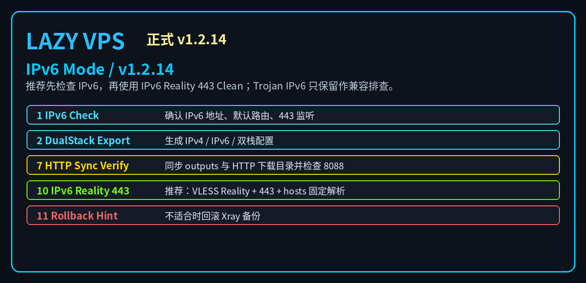

# LazyVPS Quick Menu Pack / 懒人建 VPS 快速菜单包

> 少折腾、快部署、可回滚、可分享。适合新手快速建 VPS，也适合反复测试节点、导出 FLClash / Surge 配置、做 AI / 媒体 / IPv6 / 双栈排查。



<p align="center">
  
  
  
  
  
  
</p>

---

## 目录 / 快速跳转

- [一键快速运行](#一键快速运行)
- [你想做什么？先看这里](#你想做什么先看这里)
- [推荐执行顺序](#推荐执行顺序)
- [新 VPS 快速建站流程](#一-新-vps-快速建站流程-v10-主流程)
- [IPv6 Reality 443 推荐方案](#二-ipv6-reality-443-推荐方案-v1214)
- [V4/V6 独立端口与双栈策略](#三-v4v6-独立端口与双栈策略-v1215)
- [香港入口 + AI 小鸡服务端分流](#四-香港入口--ai-小鸡服务端分流-v12)
- [媒体 DNS 解锁辅助](#五-媒体-dns-解锁辅助-v121--v122)
- [导出 / 下载 / 导入](#六-导出--下载--导入)
- [功能面板总览](#功能面板总览)
- [安全提醒](#安全提醒)
- [开源文件结构](#开源文件结构)

---

## 一键快速运行

### 方式一：下载后运行，适合开源审查

**VPS / Linux 执行：**

```bash
apt update && apt install -y curl wget
wget -O lazy-vps-menu.sh https://raw.githubusercontent.com/souldance7-ai/VPS-/main/lazy-vps-menu.sh
chmod +x lazy-vps-menu.sh
bash lazy-vps-menu.sh
```

### 方式二：一行命令直接进入互动界面

**VPS / Linux 执行：**

```bash
bash <(curl -Ls https://raw.githubusercontent.com/souldance7-ai/VPS-/main/lazy-vps-menu.sh)
```

### 预览界面

**VPS / Linux 执行：**

```bash
bash lazy-vps-menu.sh --preview
```

---

## 你想做什么？先看这里

| 需求 | 推荐入口 | 适合场景 |
|---|---|---|
| 新 VPS 快速建站 | `1 → 2 → 3 → 4 → 5/6/7 → 10 → 16` | 刚买 VPS，想快速部署协议并导入 FLClash |
| IPv6 静态公网加速 | `35 → 7 → 10` | IPv6 原生公网、纯净度好、速度高，推荐 Reality 443 |
| 指定 V4 / 指定 V6 | `35 → 7 → 12 → 13` | 同一台 VPS 同时保留 IPv6 主力与 IPv4 备用 |
| 双栈自动切换 | `35 → 7 → 13` | 生成 `V4V6_SPLIT`，Auto 优先 V6，失败切 V4 |
| AI / GPT 香港入口失败 | `35 → 3` 或 `22 Server AI Routing` | 香港速度好，但 AI 出口要转日本 / 台湾落地 |
| 流媒体 DNS 辅助 | `30 DNS Unlock` | 仅用于媒体 CDN / DNS 解析辅助，不替代干净落地 |
| 导出给电脑 / 手机 | `10 Export → 16 HTTP On` | 生成 `01_IMPORT_FLCLASH*.yaml`，浏览器/手机导入 |
| 配置坏了回滚 | `11 Backup / 12 Rollback Xray` | 改错配置、Xray 起不来、想恢复上一版 |

---

## 推荐执行顺序



### 常规新机

```text
1) System Init → 2) Stable BBR → 3) Firewall Backend → 4) Xray Core → 5/6/7 部署协议 → 10 Export → 16 HTTP On
```

### IPv6 主力 + IPv4 备用

```text
35) Stability Suite
  7) IPv6 Mode
    10) IPv6 Reality 443 Clean
    12) IPv4 Fallback Port
    13) V4/V6 Split Export
16) HTTP On
```

对应 quick 命令：

```bash
bash /root/lazy-vps-menu.sh --quick ipv6-r443
bash /root/lazy-vps-menu.sh --quick v4-fallback
bash /root/lazy-vps-menu.sh --quick v4v6-split
bash /root/lazy-vps-menu.sh --quick http
```

---

# 一、新 VPS 快速建站流程（v1.0 主流程）



| 顺序 | 菜单 | 用途 |
|---:|---|---|
| 1 | `1) System Init` | 安装依赖、确认 SSH、基础环境 |
| 2 | `2) Stable BBR` | 开启 BBR + fq |
| 3 | `3) Firewall Backend` | AUTO / UFW / NFT / IPTABLES / NONE |
| 4 | `4) Xray Core` | 安装 / 更新 Xray-core |
| 5 | `5) Trojan 443` 或 `6) VLESS Reality` | 部署协议 |
| 6 | `8) Status` | 检查 Xray、端口、防火墙 |
| 7 | `10) Export` | 导出 FLClash / Surge 配置 |
| 8 | `16) HTTP On` | 开启临时下载，电脑/手机导入 |

---

# 二、IPv6 Reality 443 推荐方案（v1.2.14）



实测结论：

| 方案 | 结果 | 建议 |
|---|---|---|
| Trojan IPv6 443 / 2443 | 在部分 FLClash / Mihomo 环境持续 Timeout | 不作为主线 |
| VLESS Reality IPv6 2444 | 可部署，但非 443 有额外风险提示 | 仅排查 |
| VLESS Reality IPv6 443 + hosts 固定解析 | 实测可通，卡片显示 `Vless` | 推荐主线 |

推荐路径：

```text
35) Stability Suite / 稳定增强工具箱
7) IPv6 Mode / IPv6 模式管理
10) IPv6 Reality 443 Clean / 推荐：纯 IPv6 VLESS Reality 443
```

快捷命令：

```bash
bash /root/lazy-vps-menu.sh --quick ipv6-r443
```

填写建议：

```text
IPv6 地址：直接 Enter 使用自动检测值
AAAA 域名：填写你自己的域名，例如 v6-r443.example.com
Reality serverName：默认 www.cloudflare.com
节点名称：默认即可
```

LazyVPS 会在导出的 FLClash 配置中写入：

```yaml
hosts:
  v6-r443.example.com: YOUR_IPV6
```

这样即使公共 DNS 暂时查不到 AAAA，FLClash 也可以直接把域名固定到你的 IPv6。

---

# 三、V4/V6 独立端口与双栈策略（v1.2.15）



v1.2.15 新增的核心逻辑：

```text
IPv6 主力：VLESS Reality 443
IPv4 备用：VLESS Reality 8443 / 自定义端口
DualStack Auto：优先 IPv6，失败后切 IPv4
```

推荐菜单：

```text
35) Stability Suite
7) IPv6 Mode
12) IPv4 Fallback Port / IPv4 备用端口部署
13) V4/V6 Split Export / V4V6 独立端口导出
14) DualStack Strategy / 双栈策略组说明
```

推荐生成文件：

| 文件 | 用途 |
|---|---|
| `01_IMPORT_FLCLASH_IPV6_REALITY_PORT443.yaml` | IPv6 主力，VLESS Reality 443 |
| `01_IMPORT_FLCLASH_IPV4_REALITY_PORT8443.yaml` | IPv4 备用，VLESS Reality 8443 |
| `01_IMPORT_FLCLASH_V4V6_SPLIT.yaml` | 同时含 V4 / V6 / Auto 策略组 |
| `01_IMPORT_FLCLASH_DUALSTACK_AUTO.yaml` | DualStack Auto 别名 |

导入后可以手动指定：

```text
🇹🇼 IPv6 主力   → 强制走 IPv6 Reality 443
🇹🇼 IPv4 备用   → 强制走 IPv4 Reality 8443
🌐 Auto         → 优先 V6，失败切 V4
```

---

# 四、香港入口 + AI 小鸡服务端分流（v1.2）



典型用途：香港入口速度很好，但香港出口无法稳定使用 ChatGPT / Claude / Gemini；此时让普通网站仍走香港，AI 域名转发到日本 / 台湾落地。

推荐入口：

```text
22) Server AI Routing / 服务端 AI 分流
23) AI Route Show / 查看服务端 AI 分流
24) AI Route Rollback / 回滚服务端 AI 分流
```

配置完成后，建议打开检测网站确认 AI 出口是否变成日本 / 台湾：

```text
https://ip.net.coffee/claude/
```

---

# 五、媒体 DNS 解锁辅助（v1.2.1 / v1.2.2）



媒体 DNS 功能用于接入 Zouter Media DNS、自定义 Media DNS 或 Alice DNS Unlock。它可以改善 Netflix / Disney+ / YouTube / TikTok 等平台的 CDN / DNS 解析，但不等于换干净落地 IP。

推荐入口：

```text
30) DNS Unlock / 媒体 DNS 解锁与导出同步
```

---

# 六、导出 / 下载 / 导入



推荐顺序：

```text
10) Export / 导出配置包
16) HTTP On / 开启临时 HTTP 下载
```

常见下载链接：

```text
http://YOUR_VPS_IPV4:8088/01_IMPORT_FLCLASH.yaml
http://YOUR_VPS_IPV4:8088/01_IMPORT_FLCLASH_IPV6_REALITY_PORT443.yaml
http://YOUR_VPS_IPV4:8088/01_IMPORT_FLCLASH_IPV4_REALITY_PORT8443.yaml
http://YOUR_VPS_IPV4:8088/01_IMPORT_FLCLASH_V4V6_SPLIT.yaml
http://YOUR_VPS_IPV4:8088/02_IMPORT_SURGE.conf
http://YOUR_VPS_IPV4:8088/lazy-vps-output-latest.tar.gz
```

FLClash 只导入：

```text
01_IMPORT_FLCLASH*.yaml
```

不要导入：

```text
DO_NOT_IMPORT_fragments
server_config_backup
reports
```

---

# 功能面板总览



| 分区 | 功能 |
|---|---|
| BASIC | 系统初始化、BBR、防火墙、Xray Core |
| PROTOCOL | Trojan / VLESS Reality / Hysteria2 |
| CHECK | 状态检查、查看输出、导出配置 |
| BACKUP | 备份、回滚、停止服务 |
| DOWNLOAD | HTTP 下载、NodeQuality、总配置合并 |
| RELAY | AI 分流、端口中转、机场链规则模板 |
| TUNE | DNS Unlock、诊断、稳定增强、IPv6 Mode |

---

# 安全提醒

- 脚本本身不内置个人 IP、私有域名、节点密码或订阅地址。
- 导出的 `01_IMPORT_FLCLASH*.yaml` 会包含你自己的节点密码 / UUID / Reality public-key，请勿公开发布。
- `HTTP On` 是临时下载服务，下载完成后建议执行 `17) HTTP Off`。
- 第三方脚本如 BBRv3、NetSpeed、DNS Unlock 可能修改内核 / DNS / 网络参数，请先看说明再执行。
- 如果配置改坏，可使用 `11 Backup` 或 `12 Rollback Xray` 回滚。

---

# 开源文件结构

```text
lazy-vps-menu.sh                  主脚本
README.md                         GitHub 首页说明
CHANGELOG.md                      更新记录
QUICK_START.md                    快速使用
IPV6_REALITY_443_GUIDE.md         IPv6 Reality 443 说明
V4V6_SPLIT_GUIDE.md               V4/V6 独立端口与双栈策略说明
AI_SERVICE_ROUTING.md             服务端 AI 分流说明
MEDIA_DNS_UNLOCK.md               媒体 DNS 辅助说明
AIRPORT_CHAIN_UNLOCK.md           机场链规则模板说明
TROUBLESHOOTING.md                排错说明
SECURITY_SHARE_CHECK.txt          分享安全检查
SCAN_REPORT.txt                   扫描报告
docs/images/                      图文说明图片
```

---

# 写在最后

v1.2.15 的重点是把 IPv6 实测结论沉淀成稳定流程：**IPv6 Reality 443 做主力，IPv4 独立备用端口，最后用 V4/V6 Split 配置让用户自由指定或自动切换。**
