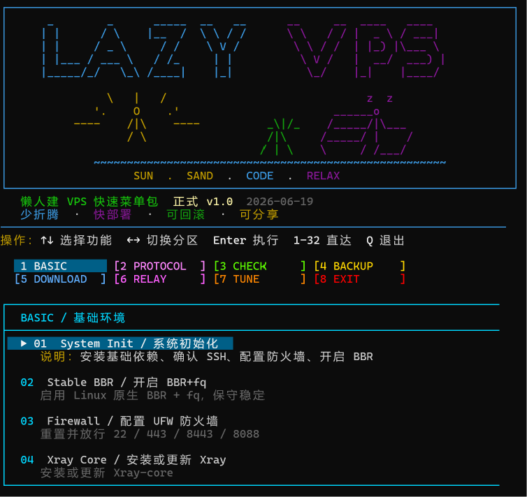
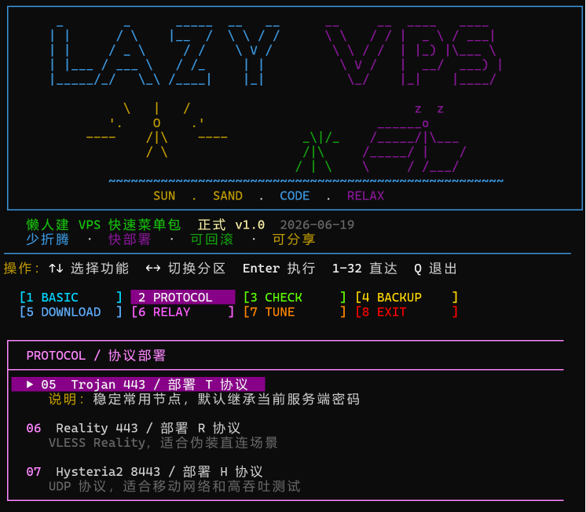
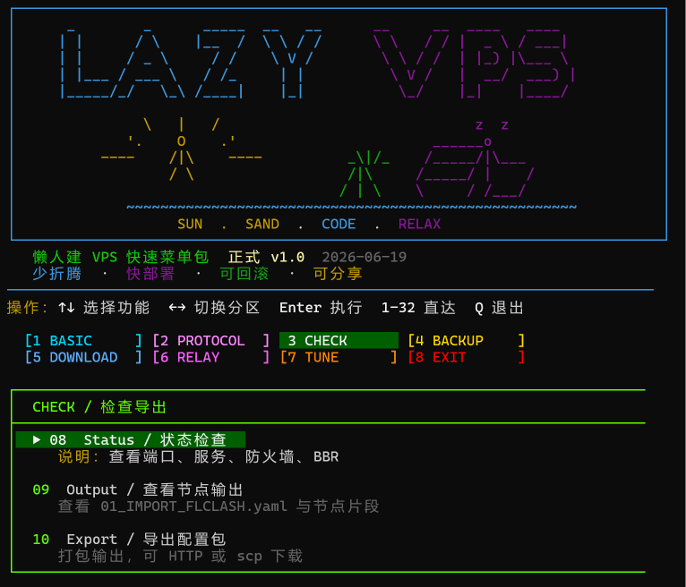
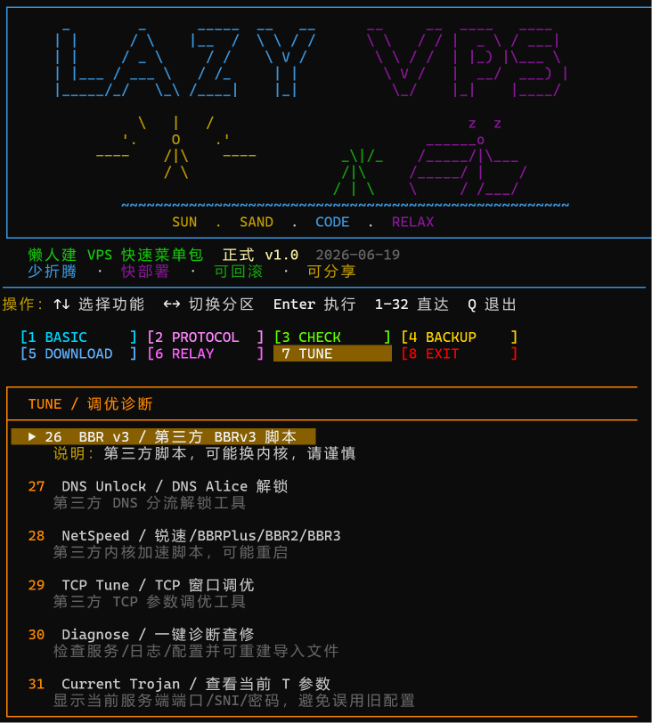
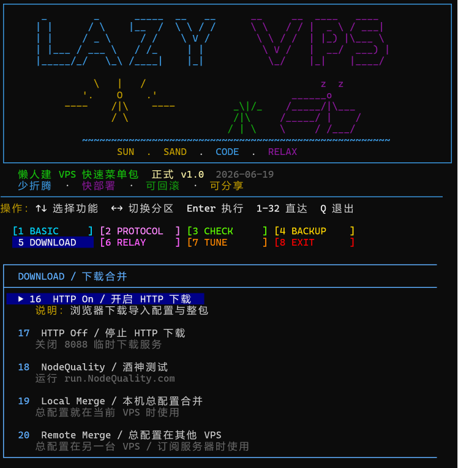
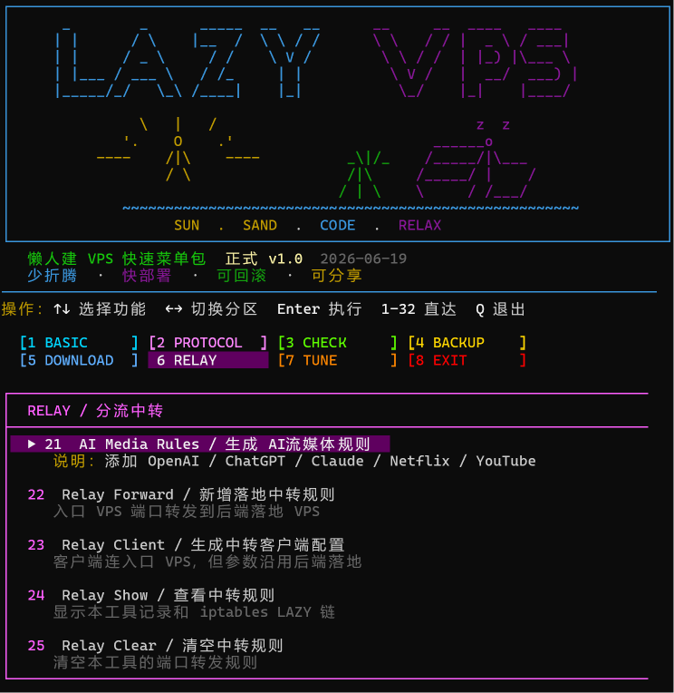
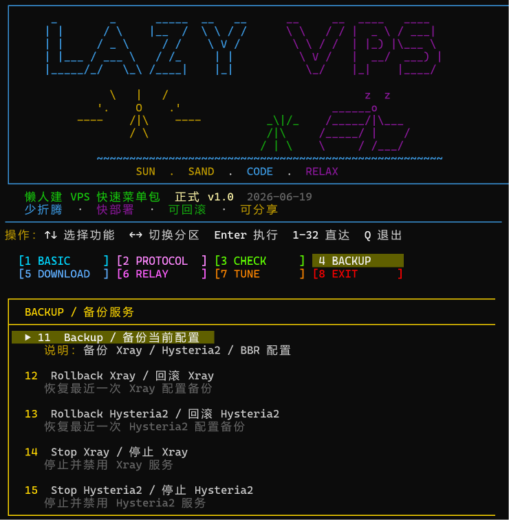

# LazyVPS Quick Menu Pack / 懒人建 VPS 快速菜单包
快速使用一鍵下載命令
</Bash>
wget -O lazy-vps-menu.sh https://raw.githubusercontent.com/souldance7-ai/VPS-/main/lazy-vps-menu.sh
chmod +x lazy-vps-menu.sh
bash lazy-vps-menu.sh
</p>
<p align="center">
  
</p>

<p align="center">
  <b>少折腾 · 快部署 · 可回滚 · 可分享</b>
</p>

<p align="center">
  
  
  
  
</p>

---

## 项目简介

**LazyVPS Quick Menu Pack** 是一个面向 VPS 新手与进阶用户的交互式快速菜单包。

它把常见 VPS 操作整理成菜单形式，适合快速完成系统初始化、协议部署、配置导出、备份回滚、分流中转与网络调优诊断。

---

## 功能亮点

| 功能区 | 说明 |
|---|---|
| BASIC 基础环境 | 系统初始化、BBR、UFW 防火墙、Xray Core |
| PROTOCOL 协议部署 | Trojan 443、Reality 443、Hysteria2 8443 |
| CHECK 检查导出 | 状态检查、节点输出、配置导出 |
| BACKUP 备份服务 | 当前配置备份、Xray / Hysteria2 回滚、停止服务 |
| DOWNLOAD 下载合并 | HTTP 下载、NodeQuality、配置合并 |
| RELAY 分流中转 | AI / 流媒体分流、中转规则、客户端配置 |
| TUNE 调优诊断 | BBRv3、DNS 解锁、TCP 调优、诊断修复 |

---

## 快速使用

```bash
chmod +x lazy-vps-menu.sh
bash lazy-vps-menu.sh
```

仅预览界面：

```bash
bash lazy-vps-menu.sh --preview
```

---

## 界面预览

### BASIC / 基础环境

<p align="center">
  
</p>

### PROTOCOL / 协议部署

<p align="center">
  
</p>

### CHECK / 检查导出

<p align="center">
  
</p>

### BACKUP / 备份服务

<p align="center">
  
</p>

### DOWNLOAD / 下载合并

<p align="center">
  
</p>

### RELAY / 分流中转

<p align="center">
  
</p>

### TUNE / 调优诊断

<p align="center">
  
</p>

---

## 折叠查看完整截图

<details>
<summary>点击展开完整菜单截图</summary>

### BASIC


### PROTOCOL


### CHECK


### BACKUP


### DOWNLOAD


### RELAY


### TUNE


</details>

---

## 操作方式

```text
↑ / ↓ 选择功能
← / → 切换分区
Enter 执行
1-32 直达功能
Q 退出
```

---

## 分享安全

本项目不内置以下敏感信息：

```text
VPS IP
私有域名
Trojan / Hysteria2 密码
订阅地址
Cloudflare Token
SSH 登录信息
```

使用前请自行检查脚本内容，并根据自己的 VPS 环境调整参数。

---

## License

MIT License
