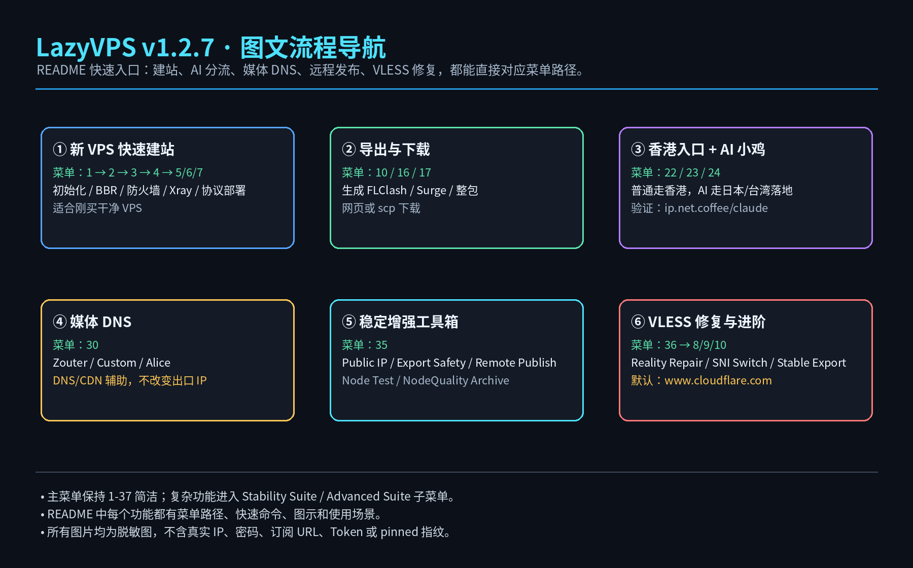
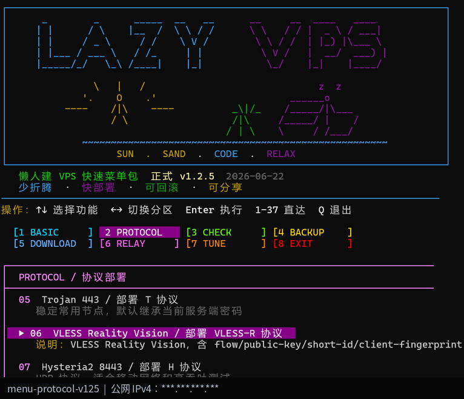
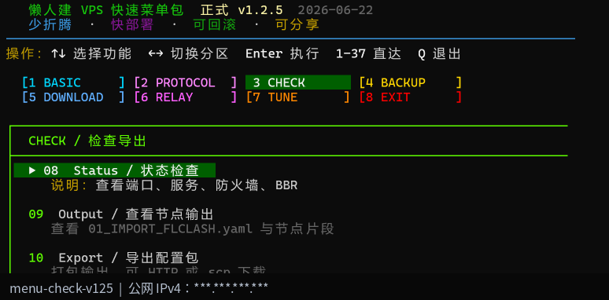
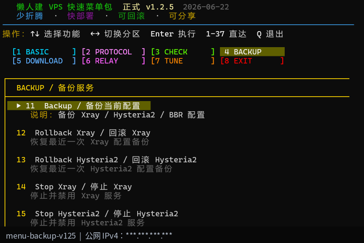
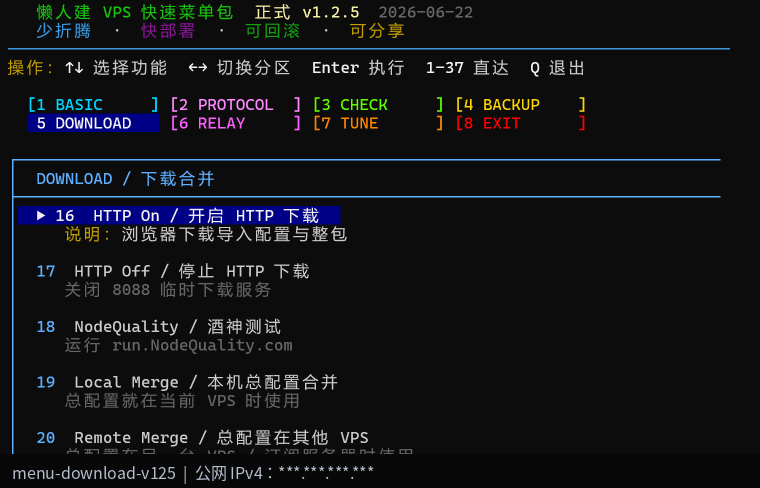
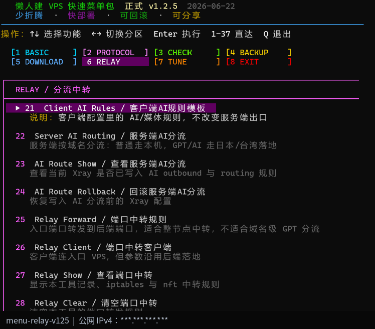
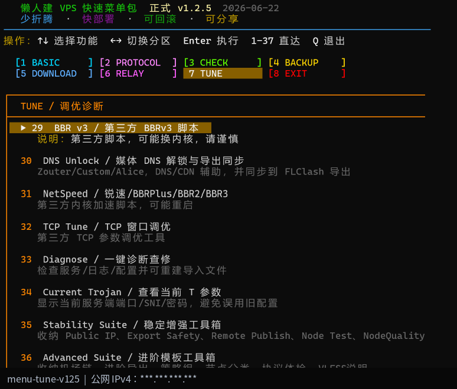
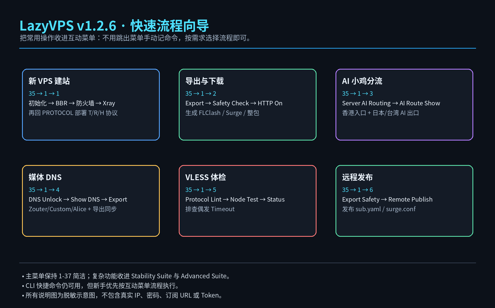
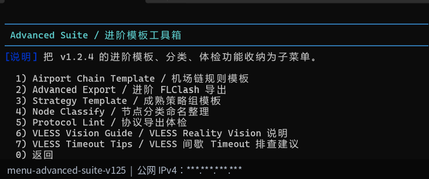

# LazyVPS Quick Menu Pack / 懒人建 VPS 快速菜单包

<p align="center">
  
</p>

<p align="center">
  <b>少折腾 · 快部署 · 可回滚 · 可分享 · 图文说明 · 快速流程向导 · VLESS Reality 修复</b>
</p>

<p align="center">
  
  
  
  
  
</p>

---

## 📌 快速使用

### VPS 内一键下载并运行

```bash
wget -O lazy-vps-menu.sh https://raw.githubusercontent.com/souldance7-ai/VPS-/main/lazy-vps-menu.sh
chmod +x lazy-vps-menu.sh
bash lazy-vps-menu.sh
```

### 一行命令

```bash
wget -O lazy-vps-menu.sh https://raw.githubusercontent.com/souldance7-ai/VPS-/main/lazy-vps-menu.sh && chmod +x lazy-vps-menu.sh && bash lazy-vps-menu.sh
```

### 仅预览界面

```bash
bash lazy-vps-menu.sh --preview
```

---

## 🚀 你想做什么？先看这里

| 需求 | 菜单路径 | 快速命令 | 适合场景 |
|---|---|---|---|
| 新 VPS 快速建站 | `35 → 1 → 1` | 交互菜单执行 | 初始化、BBR、防火墙、Xray Core |
| 部署 Trojan | `2) PROTOCOL → 5` | `--quick trojan` | 稳定主用、兼容性优先 |
| 部署 VLESS Reality Vision | `2) PROTOCOL → 6` | `--quick reality` | 进阶协议、Reality Vision |
| 导出并开启下载 | `35 → 1 → 2` | `--quick export` | Export → Safety Check → HTTP On |
| 香港入口 + AI 小鸡 | `35 → 1 → 3` | `--quick ai-route` | 普通走香港，AI 走日本/台湾落地 |
| Media DNS 流媒体辅助 | `35 → 1 → 4` | `--quick media-dns` | Zouter / Custom / Alice DNS |
| VLESS 偶发 Timeout 排查 | `35 → 1 → 5` 或 `36 → 8/9/10` | `--quick reality-repair` | Reality 握手不稳、测速 Timeout |
| 远程订阅发布 | `35 → 1 → 6` | `--quick remote-publish` | 发布 sub.yaml / surge.conf 到订阅服务器 |
| 进阶 FLClash 模板 | `36 → 2` | `--quick advanced-export` | 多策略组、机场链、自建/外购分类 |
| 节点分类命名 | `36 → 4` | `--quick node-classify` | 节点越来越多时整理命名 |
| 协议导出体检 | `36 → 5` | `--quick protocol-lint` | 检查 VLESS / Trojan / Hysteria2 字段完整性 |

> 建议新手优先走菜单流程，不需要记命令。  
> 快速命令主要给进阶用户或远程维护时使用。

---

## 🧭 版本主线

| 版本 | 重点 |
|---|---|
| **v1.0** | 新 VPS 快速建站、Trojan 443、导出配置、HTTP 下载 |
| **v1.2** | 服务端 AI 分流：香港入口 + 日本 / 台湾 AI 落地 |
| **v1.2.2** | Media DNS 与 Export 同步 |
| **v1.2.3** | Public IP Guard / Remote Publish / Node Test / NodeQuality 归档 |
| **v1.2.4** | VLESS Reality Vision / Advanced Export / 节点分类 / 协议体检 |
| **v1.2.5** | 主界面精简，Stability Suite / Advanced Suite 工具箱化 |
| **v1.2.6** | 图文 README、实际界面截图、Guided Workflows 流程向导 |
| **v1.2.7** | Reality 默认改为 `www.cloudflare.com`，新增 Reality 修复向导与稳定导出 |

---

# 一、主菜单布局

<p align="center">
  
</p>

v1.2.7 主菜单保持精简，不再把所有功能堆到同一页。

| 分区 | 菜单范围 | 说明 |
|---|---|---|
| BASIC | `1-4` | 初始化、BBR、防火墙、Xray |
| PROTOCOL | `5-7` | Trojan / VLESS Reality Vision / Hysteria2 |
| CHECK | `8-10` | Status / Output / Export |
| BACKUP | `11-15` | 备份、回滚、停止服务 |
| DOWNLOAD | `16-20` | HTTP 下载、NodeQuality、配置合并 |
| RELAY | `21-28` | AI 规则、服务端 AI 分流、端口中转 |
| TUNE | `29-37` | 调优、诊断、Stability Suite、Advanced Suite |

---

# 二、BASIC / 基础环境

<p align="center">
  
</p>

推荐新 VPS 先执行：

```text
1) System Init
2) Stable BBR
3) Firewall Backend
4) Xray Core
```

对应用途：

| 菜单 | 用途 |
|---|---|
| `1) System Init` | 安装基础依赖、确认 SSH、配置基础环境 |
| `2) Stable BBR` | 开启 Linux 原生 BBR + fq |
| `3) Firewall Backend` | AUTO / UFW / NFT / IPTABLES / NONE |
| `4) Xray Core` | 安装或更新 Xray Core |

---

# 三、PROTOCOL / 协议部署

<p align="center">
  
</p>

| 菜单 | 协议 | 建议 |
|---|---|---|
| `5) Trojan 443` | Trojan TCP 443 | 稳定主用，兼容性好 |
| `6) VLESS Reality Vision` | VLESS Reality Vision | 进阶协议，支持 flow / public-key / short-id / fingerprint |
| `7) Hysteria2 8443` | Hysteria2 UDP | 移动网络、高吞吐测试场景 |

## VLESS Reality Vision 推荐字段

v1.2.7 起默认推荐：

```yaml
type: vless
tls: true
flow: xtls-rprx-vision
servername: www.cloudflare.com
reality-opts:
  public-key: <public-key>
  short-id: <short-id>
client-fingerprint: chrome
```

> 说明：  
> 之前 `www.microsoft.com` 在日本 Zouter 测试中出现 Timeout；切换 `www.cloudflare.com` 后恢复正常，因此 v1.2.7 默认统一为 Cloudflare。

---

# 四、CHECK / 检查导出

<p align="center">
  
</p>

| 菜单 | 用途 |
|---|---|
| `8) Status` | 查看 Xray、端口、防火墙、BBR |
| `9) Output` | 查看导出片段 |
| `10) Export` | 导出 FLClash / Surge / 整包 |

导出文件：

```text
01_IMPORT_FLCLASH.yaml
02_IMPORT_SURGE.conf
lazy-vps-output-latest.tar.gz
```

---

# 五、BACKUP / 备份服务

<p align="center">
  
</p>

| 菜单 | 用途 |
|---|---|
| `11) Backup` | 备份 Xray / Hysteria2 / BBR 配置 |
| `12) Rollback Xray` | 回滚最近一次 Xray 配置 |
| `13) Rollback Hysteria2` | 回滚最近一次 Hysteria2 配置 |
| `14) Stop Xray` | 停止并禁用 Xray |
| `15) Stop Hysteria2` | 停止并禁用 Hysteria2 |

---

# 六、DOWNLOAD / 下载合并

<p align="center">
  
</p>

| 菜单 | 用途 |
|---|---|
| `16) HTTP On` | 开启 8088 临时下载 |
| `17) HTTP Off` | 关闭临时下载 |
| `18) NodeQuality` | 运行酒神测试 |
| `19) Local Merge` | 当前 VPS 本机总配置合并 |
| `20) Remote Merge` | 总配置在其他 VPS / 订阅服务器时使用 |

---

# 七、RELAY / 分流中转

<p align="center">
  
</p>

| 菜单 | 功能 | 说明 |
|---|---|---|
| `21) Client AI Rules` | 客户端 AI 规则模板 | 不改变服务端出口 |
| `22) Server AI Routing` | 服务端 AI 分流 | 普通走本机，GPT/AI 走日本/台湾落地 |
| `23) AI Route Show` | 查看服务端 AI 分流 | 查看 Xray 是否写入 AI outbound / routing |
| `24) AI Route Rollback` | 回滚服务端 AI 分流 | 恢复写入 AI 分流前配置 |
| `25-28)` | Relay Forward / Client / Show / Clear | 端口中转，不适合域名级 GPT 分流 |

## Server AI Routing 逻辑图

<p align="center">
  
</p>

---

# 八、TUNE / 调优诊断

<p align="center">
  
</p>

v1.2.7 的 TUNE 不再无限拉长：

```text
29) BBR v3
30) DNS Unlock
31) NetSpeed
32) TCP Tune
33) Diagnose
34) Current Trojan
35) Stability Suite
36) Advanced Suite
37) Exit
```

---

# 九、Guided Workflows / 快速流程向导

路径：

```text
35) Stability Suite / 稳定增强工具箱
1) Guided Workflows / 快速流程向导
```

<p align="center">
  
</p>

| 序号 | 流程 | 实际执行 |
|---|---|---|
| `1` | 新 VPS 快速建站 | 初始化 → BBR → 防火墙 → Xray |
| `2` | 导出与下载 | Export → Export Safety → HTTP On |
| `3` | 香港入口 + AI 小鸡 | Server AI Routing → AI Route Show |
| `4` | Media DNS 流媒体辅助 | DNS Unlock → Show DNS → Export |
| `5` | VLESS 稳定性检查 | Protocol Lint → Node Test → Status |
| `6` | 远程订阅发布 | Export Safety → Remote Publish |

---

# 十、Advanced Suite / 进阶模板工具箱

路径：

```text
36) Advanced Suite / 进阶模板工具箱
```

<p align="center">
  
</p>

包含：

```text
1) Airport Chain Template
2) Advanced Export
3) Strategy Template
4) Node Classify
5) Protocol Lint
6) VLESS Vision Guide
7) VLESS Timeout Tips
8) VLESS Reality Repair
9) Reality SNI Switch
10) VLESS Stable Export
```

---

# 十一、VLESS Reality 修复与稳定导出（v1.2.7）

<p align="center">
  
</p>

## 什么时候用？

适合这种情况：

```text
Windows → VPS:443 可以通
Xray active running
UUID / public-key / short-id / flow 都一致
但是 FLClash Reality 节点 Timeout
```

## 修复入口

菜单路径：

```text
36) Advanced Suite
8) VLESS Reality Repair / Reality 修复向导
9) Reality SNI Switch / Reality 目标切换
10) VLESS Stable Export / VLESS 稳定导出
```

快速命令：

```bash
bash /root/lazy-vps-menu.sh --quick reality-repair
bash /root/lazy-vps-menu.sh --quick sni-switch
bash /root/lazy-vps-menu.sh --quick vless-stable
```

## SNI 目标切换

v1.2.7 默认：

```text
www.cloudflare.com
```

可切换：

```text
www.microsoft.com
www.apple.com
www.yahoo.com
自定义
```

## VLESS Stable Export

生成：

```text
01_IMPORT_FLCLASH_VLESS_STABLE.yaml
```

特点：

```text
tcp-concurrent: false
自动加入代理服务器 IP / 域名 DIRECT,no-resolve
适合 Reality 偶发 Timeout 时做稳定性对比
```

---

# 十二、Media DNS / 流媒体 DNS 辅助

<p align="center">
  
</p>

菜单：

```text
30) DNS Unlock / 媒体 DNS 解锁与导出同步
```

内置模板：

```text
Zouter Media DNS：151.243.229.229
```

说明：

```text
Media DNS 只解决 DNS / CDN 解析问题，不会改变 VPS 出口 IP。
如果平台主要判断出口 IP 是否干净，仍需要换落地、机场链或服务端分流。
```

---

# 十三、Airport Chain / 机场链

<p align="center">
  
</p>

说明：

```text
自建 VPS 做普通入口；
AI / 流媒体域名交给外购机场策略组；
客户端按规则分流。
```

不内置：

```text
机场订阅 URL
Token
节点 password
私有域名
```

---

# 十四、导出文件说明

| 文件 | 用途 |
|---|---|
| `01_IMPORT_FLCLASH.yaml` | 基础 FLClash 导入，优先测试用 |
| `01_IMPORT_FLCLASH_VLESS_STABLE.yaml` | VLESS 稳定导出，排查 Timeout 用 |
| `01_IMPORT_FLCLASH_ADVANCED.yaml` | 进阶总配置模板，多策略组使用 |
| `02_IMPORT_SURGE.conf` | Surge 导入 |
| `lazy-vps-output-latest.tar.gz` | 整包下载 |

不要导入：

```text
DO_NOT_IMPORT 开头的片段
server_config_backup
服务端备份文件
```

---

# 十五、快速命令

互动菜单优先，以下给进阶用户：

```bash
bash /root/lazy-vps-menu.sh --quick export
bash /root/lazy-vps-menu.sh --quick advanced-export
bash /root/lazy-vps-menu.sh --quick vless-stable
bash /root/lazy-vps-menu.sh --quick protocol-lint
bash /root/lazy-vps-menu.sh --quick node-test
bash /root/lazy-vps-menu.sh --quick media-dns
bash /root/lazy-vps-menu.sh --quick dns-show
bash /root/lazy-vps-menu.sh --quick dns-rollback
bash /root/lazy-vps-menu.sh --quick public-ip
bash /root/lazy-vps-menu.sh --quick remote-publish
bash /root/lazy-vps-menu.sh --quick reality-repair
bash /root/lazy-vps-menu.sh --quick sni-switch
bash /root/lazy-vps-menu.sh --quick vless-timeout
```

---

## 分享安全

本项目不内置：

```text
VPS IP
私有域名
Trojan / Hysteria2 密码
机场订阅 URL / Token
Cloudflare Token
SSH 登录信息
```

所有 README 示意图均为脱敏示意图，不包含真实 IP、password、pinnedPeerCertSha256 或机场订阅信息。

---

## License

MIT License
