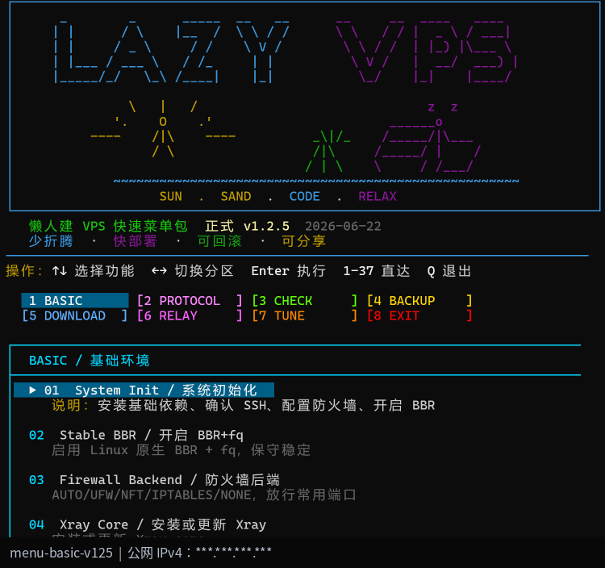
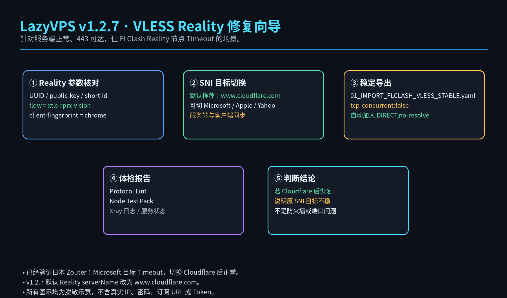

# LazyVPS Quick Menu Pack / 懒人建 VPS 快速菜单包

<p align="center">
  
</p>

<p align="center">
  <b>少折腾 · 快部署 · 可回滚 · 可分享 · 默认 Cloudflare Reality 目标 · VLESS 稳定导出</b>
</p>

<p align="center">
  
  
  
</p>

---

## 快速使用

```bash
wget -O lazy-vps-menu.sh https://raw.githubusercontent.com/souldance7-ai/VPS-/main/lazy-vps-menu.sh
chmod +x lazy-vps-menu.sh
bash lazy-vps-menu.sh
```

---

## v1.2.7 更新重点

这版针对实际测试中发现的 VLESS Reality Timeout 问题做修复。

实测结论：

```text
日本 Zouter VLESS Reality 使用 www.microsoft.com 目标时 Timeout；
切换 Reality 目标到 www.cloudflare.com 后恢复正常。
```

因此 v1.2.7 调整为：

| 项目 | 调整 |
|---|---|
| Reality 默认 serverName | 统一改为 `www.cloudflare.com` |
| SNI Switch | 可在 Cloudflare / Microsoft / Apple / Yahoo 间切换 |
| Repair Wizard | 自动核对 VLESS Reality 参数、public-key、short-id、flow |
| Stable Export | 生成 `01_IMPORT_FLCLASH_VLESS_STABLE.yaml` |
| DIRECT 规则 | 导出时自动加入代理服务器 IP / 域名直连规则，避免回环 |
| Advanced Export | 作为进阶配置使用，基础测试优先用普通导出或稳定导出 |

---

## VLESS Reality 修复流程

<p align="center">
  
</p>

菜单路径：

```text
36) Advanced Suite
8) VLESS Reality Repair / Reality 修复向导
9) Reality SNI Switch / Reality 目标切换
10) VLESS Stable Export / VLESS 稳定导出
```

快捷命令：

```bash
bash /root/lazy-vps-menu.sh --quick reality-repair
bash /root/lazy-vps-menu.sh --quick sni-switch
bash /root/lazy-vps-menu.sh --quick vless-stable
```

---

## 推荐 VLESS Reality 配置

```yaml
type: vless
tls: true
flow: xtls-rprx-vision
servername: www.cloudflare.com
reality-opts:
  public-key: <public-key>
  short-id: <short-id>
client-fingerprint: chrome
```

说明：

- `www.cloudflare.com` 作为默认 Reality 目标更好记，也在本次 Zouter 日本实测中恢复正常。
- 如果某地区 Cloudflare 不稳，可用 `Reality SNI Switch` 切换到 Microsoft / Apple / Yahoo。
- 基础测试优先导入 `01_IMPORT_FLCLASH.yaml` 或 `01_IMPORT_FLCLASH_VLESS_STABLE.yaml`。
- `01_IMPORT_FLCLASH_ADVANCED.yaml` 是总配置 / 多策略组场景用，不建议拿它做单节点第一轮连通测试。

---

## 当前主菜单结构

| 分区 | 内容 |
|---|---|
| BASIC | 初始化、BBR、防火墙、Xray |
| PROTOCOL | Trojan、VLESS Reality Vision、Hysteria2 |
| CHECK | Status、Output、Export |
| BACKUP | Backup、Rollback、Stop |
| DOWNLOAD | HTTP 下载、NodeQuality、配置合并 |
| RELAY | AI 规则、服务端 AI 分流、端口中转 |
| TUNE | BBRv3、DNS Unlock、NetSpeed、TCP Tune、Diagnose、Current Trojan、Stability Suite、Advanced Suite |

---

## 分享安全

本项目不内置：

```text
VPS IP
私有域名
Trojan / Hysteria2 密码
机场订阅 URL / Token
Cloudflare Token
SSH 登录信息
```

所有 README 示意图均为脱敏示意图，不包含真实 IP、password、pinnedPeerCertSha256 或机场订阅信息。

---

## License

MIT License
