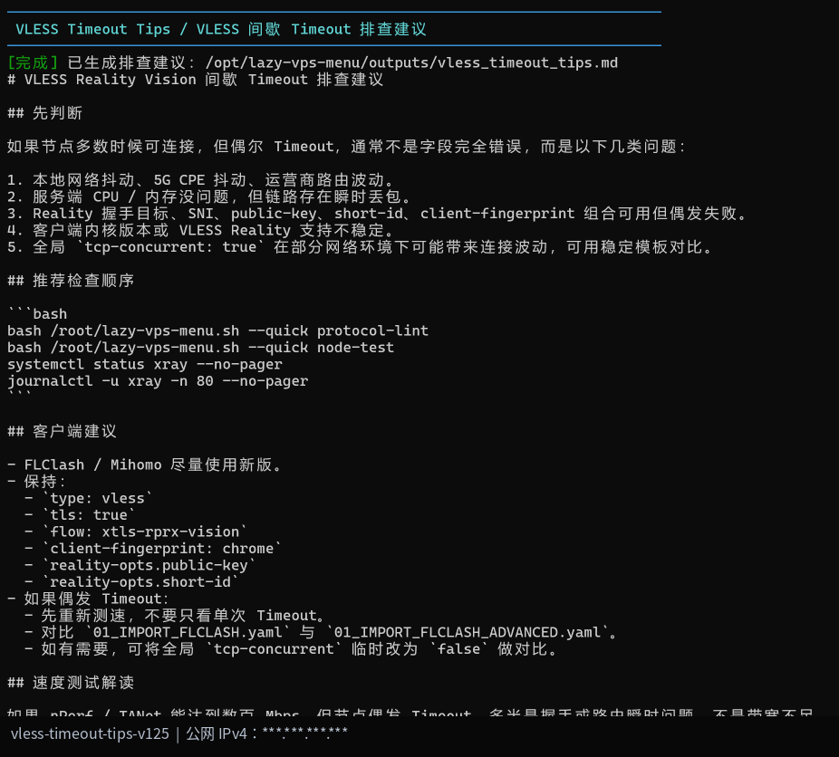
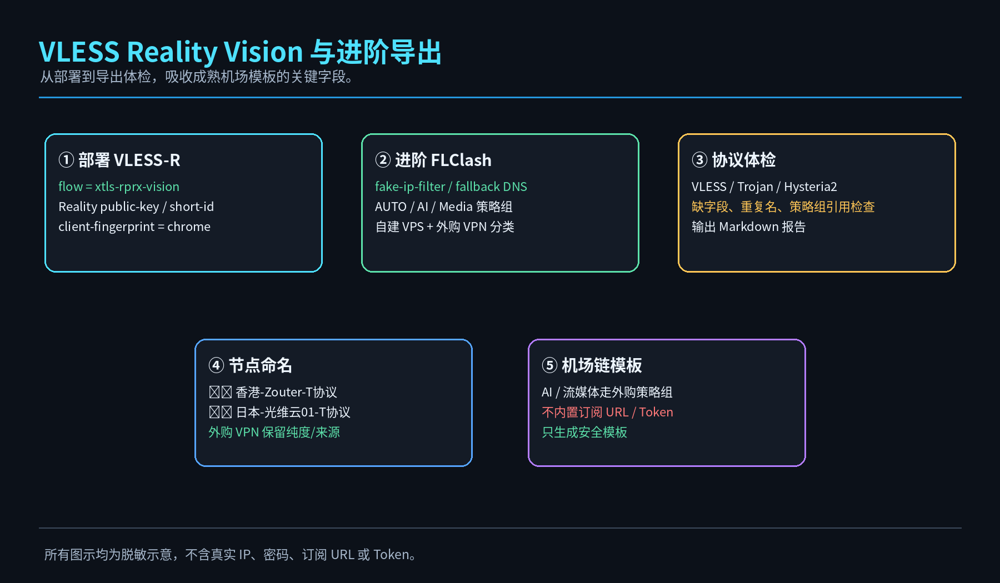

# LazyVPS Quick Menu Pack / 懒人建 VPS 快速菜单包

<p align="center">
  
</p>

<p align="center">
  <b>少折腾 · 快部署 · 可回滚 · 可分享 · 菜单精简 · 流程向导 · VLESS 稳定排查</b>
</p>

<p align="center">
  
  
  
  
</p>

---

## 快速使用

### VPS 内一键下载并运行

```bash
wget -O lazy-vps-menu.sh https://raw.githubusercontent.com/souldance7-ai/VPS-/main/lazy-vps-menu.sh
chmod +x lazy-vps-menu.sh
bash lazy-vps-menu.sh
```

### 一行命令

```bash
wget -O lazy-vps-menu.sh https://raw.githubusercontent.com/souldance7-ai/VPS-/main/lazy-vps-menu.sh && chmod +x lazy-vps-menu.sh && bash lazy-vps-menu.sh
```

### 仅预览界面

```bash
bash lazy-vps-menu.sh --preview
```

---

## 你想做什么？先看这里

| 需求 | 菜单路径 | 适合场景 |
|---|---|---|
| 新 VPS 快速建站 | `35) Stability Suite → 1) Guided Workflows → 1` | 初始化、BBR、防火墙、Xray Core |
| 部署协议 | `2) PROTOCOL → 5/6/7` | Trojan / VLESS Reality Vision / Hysteria2 |
| 导出并下载配置 | `35) Stability Suite → 1) Guided Workflows → 2` | Export → Safety Check → HTTP On |
| 香港入口 + AI 小鸡 | `35) Stability Suite → 1) Guided Workflows → 3` | Server AI Routing → AI Route Show |
| 媒体 DNS 解锁辅助 | `35) Stability Suite → 1) Guided Workflows → 4` | DNS Unlock → Show DNS → Export |
| VLESS 偶发 Timeout 排查 | `35) Stability Suite → 1) Guided Workflows → 5` | Protocol Lint → Node Test → Status |
| 远程订阅发布 | `35) Stability Suite → 1) Guided Workflows → 6` | 发布 sub.yaml / surge.conf 到远程服务器 |
| 进阶模板 / 机场链 | `36) Advanced Suite` | 进阶 FLClash、机场链、节点分类、协议体检 |

---

## v1.2.6 更新重点

这版主要解决两个问题：

1. **README 要图文并茂、快速跳页、对照菜单位置。**
2. **不要让使用者在互动菜单里还要跳出来记命令。**

新增：

```text
35) Stability Suite
  1) Guided Workflows / 快速流程向导
```

<p align="center">
  
</p>

---

# 一、主菜单布局

v1.2.6 继续保持主菜单精简，不再把所有功能堆在 TUNE 页面。

| 分区 | 菜单范围 | 说明 |
|---|---|---|
| BASIC | `1-4` | 初始化、BBR、防火墙、Xray |
| PROTOCOL | `5-7` | Trojan / VLESS Reality Vision / Hysteria2 |
| CHECK | `8-10` | 状态、输出、导出 |
| BACKUP | `11-15` | 备份、回滚、停止服务 |
| DOWNLOAD | `16-20` | HTTP 下载、NodeQuality、配置合并 |
| RELAY | `21-28` | AI 规则、服务端 AI 分流、端口中转 |
| TUNE | `29-37` | 调优、诊断、稳定工具箱、进阶工具箱 |

## BASIC / 基础环境

<p align="center">
  
</p>

建议新 VPS 先执行：

```text
1) System Init
2) Stable BBR
3) Firewall Backend
4) Xray Core
```

---

## PROTOCOL / 协议部署

<p align="center">
  
</p>

协议选择：

| 菜单 | 协议 | 建议 |
|---|---|---|
| `5)` | Trojan 443 | 稳定主用，兼容性好 |
| `6)` | VLESS Reality Vision | 进阶协议，支持 flow/public-key/short-id/client-fingerprint |
| `7)` | Hysteria2 8443 | UDP 高吞吐场景，可作测试备用 |

VLESS Reality Vision 核心字段：

```yaml
type: vless
tls: true
flow: xtls-rprx-vision
servername: www.microsoft.com
reality-opts:
  public-key: <public-key>
  short-id: <short-id>
client-fingerprint: chrome
```

---

## CHECK / 检查导出

<p align="center">
  
</p>

常用：

```text
8) Status       查看服务/端口/防火墙/BBR
9) Output       查看导出片段
10) Export      导出 FLClash / Surge / 整包
```

---

## BACKUP / 备份服务

<p align="center">
  
</p>

常用：

```text
11) Backup
12) Rollback Xray
13) Rollback Hysteria2
14) Stop Xray
15) Stop Hysteria2
```

---

## DOWNLOAD / 下载合并

<p align="center">
  
</p>

常用：

```text
16) HTTP On
17) HTTP Off
18) NodeQuality
19) Local Merge
20) Remote Merge
```

---

## RELAY / 分流中转

<p align="center">
  
</p>

用途区别：

| 菜单 | 功能 | 说明 |
|---|---|---|
| `21)` | Client AI Rules | 只改客户端规则，不改服务端出口 |
| `22)` | Server AI Routing | 服务端按域名分流，香港入口 + 日本/台湾 AI 出口 |
| `23)` | AI Route Show | 查看 AI outbound 与 routing 是否写入 |
| `24)` | AI Route Rollback | 回滚服务端 AI 分流 |
| `25-28)` | Relay Forward / Client / Show / Clear | 端口中转，不适合域名级 GPT 分流 |

---

## TUNE / 调优诊断

<p align="center">
  
</p>

v1.2.6 的 TUNE 分区不再无限拉长：

```text
29) BBR v3
30) DNS Unlock
31) NetSpeed
32) TCP Tune
33) Diagnose
34) Current Trojan
35) Stability Suite
36) Advanced Suite
37) Exit
```

---

# 二、快速流程向导

进入：

```text
35) Stability Suite / 稳定增强工具箱
1) Guided Workflows / 快速流程向导
```

可直接执行：

| 序号 | 流程 | 实际执行 |
|---|---|---|
| `1` | 新 VPS 快速建站 | 初始化 → BBR → 防火墙 → Xray |
| `2` | 导出与下载 | Export → Export Safety → HTTP On |
| `3` | 香港入口 + AI 小鸡 | Server AI Routing → AI Route Show |
| `4` | Media DNS 流媒体辅助 | DNS Unlock → Show DNS → Export |
| `5` | VLESS 稳定性检查 | Protocol Lint → Node Test → Status |
| `6` | 远程订阅发布 | Export Safety → Remote Publish |

---

# 三、Advanced Suite / 进阶模板工具箱

<p align="center">
  
</p>

路径：

```text
36) Advanced Suite / 进阶模板工具箱
```

包含：

```text
1) Airport Chain Template
2) Advanced Export
3) Strategy Template
4) Node Classify
5) Protocol Lint
6) VLESS Vision Guide
7) VLESS Timeout Tips
```

---

# 四、VLESS 偶发 Timeout 排查

<p align="center">
  
</p>

如果节点多数时候可连，偶尔 Timeout，通常不是字段完全错，优先排查：

```text
1. 5G CPE / 本地网络抖动
2. 运营商路由瞬时波动
3. Reality 握手偶发失败
4. 客户端内核版本对 VLESS Reality 支持不稳定
5. tcp-concurrent 在个别网络环境下可能波动
```

在菜单中执行：

```text
35) Stability Suite → 1) Guided Workflows → 5
```

或：

```text
36) Advanced Suite → 7) VLESS Timeout Tips
```

---

# 五、核心逻辑图

## Server AI Routing / 服务端 AI 分流

<p align="center">
  
</p>

## Media DNS / 流媒体 DNS 辅助

<p align="center">
  
</p>

## Airport Chain / 机场链

<p align="center">
  
</p>

## VLESS Vision 与进阶导出

<p align="center">
  
</p>

---

# 六、导出文件说明

常用导出：

```text
01_IMPORT_FLCLASH.yaml
02_IMPORT_SURGE.conf
lazy-vps-output-latest.tar.gz
```

进阶导出：

```text
01_IMPORT_FLCLASH_ADVANCED.yaml
```

注意：

```text
DO_NOT_IMPORT 开头的文件只是片段，不要导入客户端。
server_config_backup 仅为服务端备份，不要导入客户端。
```

---

# 七、快速命令

互动菜单优先，下面是进阶用户可选快捷命令：

```bash
bash /root/lazy-vps-menu.sh --quick export
bash /root/lazy-vps-menu.sh --quick advanced-export
bash /root/lazy-vps-menu.sh --quick protocol-lint
bash /root/lazy-vps-menu.sh --quick node-test
bash /root/lazy-vps-menu.sh --quick media-dns
bash /root/lazy-vps-menu.sh --quick dns-show
bash /root/lazy-vps-menu.sh --quick dns-rollback
bash /root/lazy-vps-menu.sh --quick public-ip
bash /root/lazy-vps-menu.sh --quick remote-publish
bash /root/lazy-vps-menu.sh --quick vless-timeout
```

---

## 分享安全

本项目不内置：

```text
VPS IP
私有域名
Trojan / Hysteria2 密码
机场订阅 URL / Token
Cloudflare Token
SSH 登录信息
```

所有 README 示意图均为脱敏示意图，不包含真实 IP、password、pinnedPeerCertSha256 或机场订阅信息。

---

## License

MIT License
