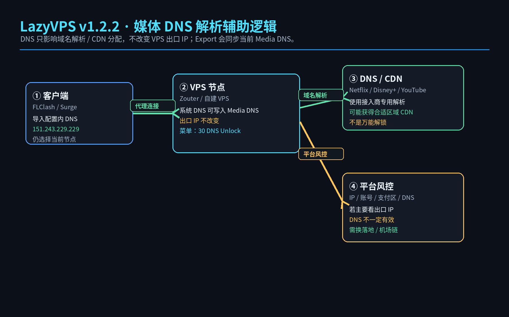
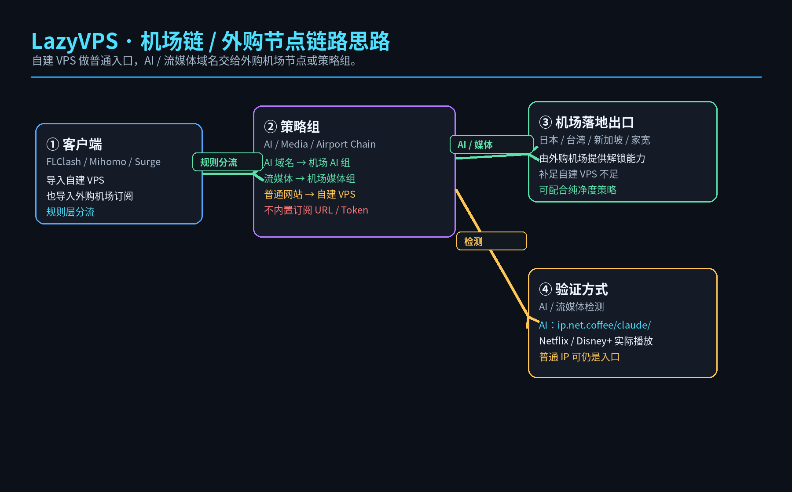
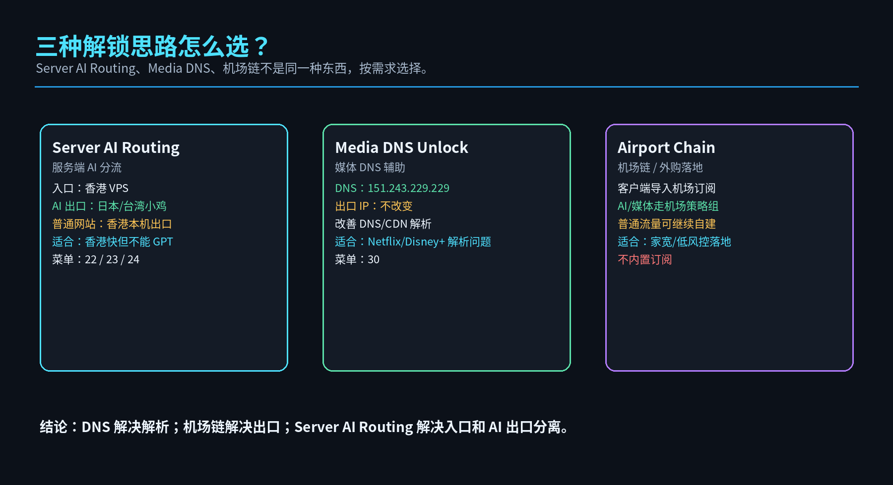
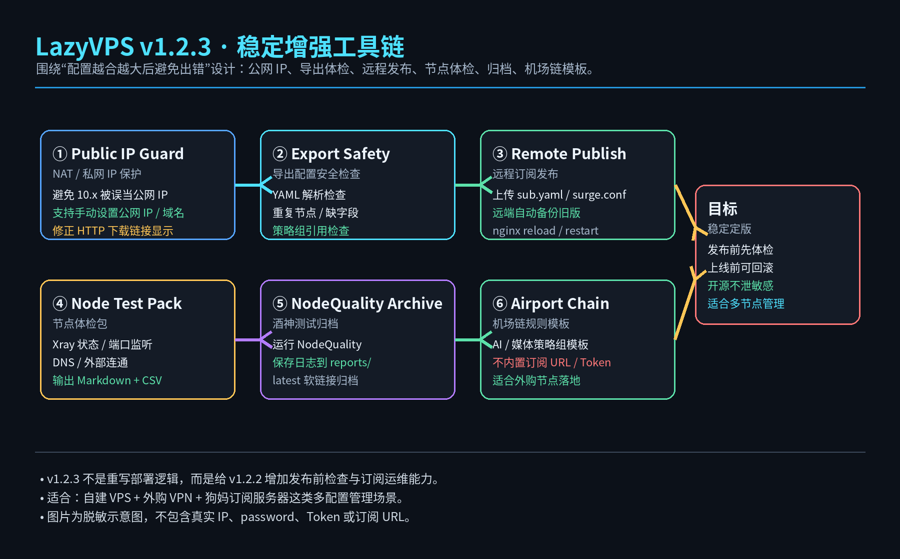
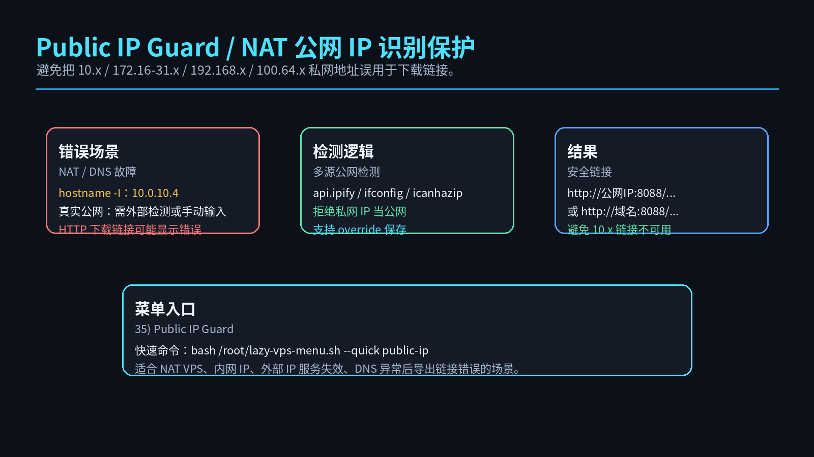
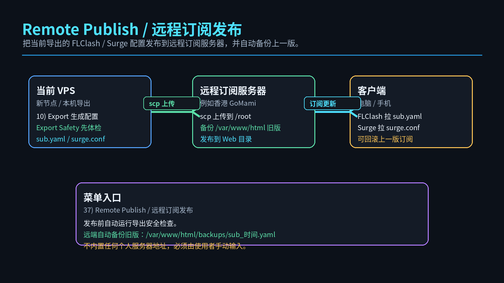
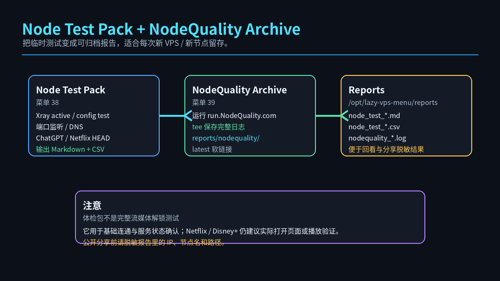

# LazyVPS Quick Menu Pack / 懒人建 VPS 快速菜单包

<p align="center">
  
</p>

<p align="center">
  <b>少折腾 · 快部署 · 可回滚 · 可分享 · 支持服务端 AI 分流、媒体 DNS 与订阅发布体检</b>
</p>

<p align="center">
  
  
  
  
</p>

---

## 你想做什么？先看这里

| 需求 | 直接看哪一段 | 适合场景 |
|---|---|---|
| **新 VPS 快速建站 / 建节点** | [一、新 VPS 快速建站流程](#一新-vps-快速建站流程v10-主流程) | 新买 VPS，要快速部署 Trojan / Reality / Hysteria2，并导出 FLClash / Surge 配置 |
| **香港节点要能用 GPT / Claude** | [二、香港入口节点附挂小鸡使用 AI / GPT](#二香港入口节点附挂小鸡使用-ai--gptv12-更新) | 香港节点速度好，但香港出口不能 GPT，需要把 AI 域名分流到日本 / 台湾落地 |
| **流媒体 DNS / CDN 区域解析辅助** | [三、媒体 DNS 解锁辅助](#三媒体-dns-解锁辅助v122-更新) | 接入商提供 Media DNS，例如 Zouter `151.243.229.229`，用于改善流媒体 DNS/CDN 解析 |
| **机场链 / 外购节点做 AI 或媒体落地** | [四、机场链 / 外购节点链路思路](#四机场链--外购节点链路思路可用于-ai--媒体) | 自建 VPS 做入口，AI / 流媒体走外购机场策略组或纯净节点 |
| **发布前检查 / 远程订阅发布** | [五、v1.2.3 稳定增强工具链](#五v123-稳定增强工具链) | 防止私网 IP、YAML 错误、订阅发布覆盖错误、测试结果无法归档 |
| **完整菜单截图** | [六、完整菜单界面预览](#六完整菜单界面预览) | 了解 BASIC / PROTOCOL / CHECK / BACKUP / DOWNLOAD / RELAY / TUNE |

---

# 一、新 VPS 快速建站流程（v1.0 主流程）

```bash
wget -O lazy-vps-menu.sh https://raw.githubusercontent.com/souldance7-ai/VPS-/main/lazy-vps-menu.sh
chmod +x lazy-vps-menu.sh
bash lazy-vps-menu.sh
```

推荐执行顺序：

```text
1) System Init
2) Stable BBR
3) Firewall Backend
4) Xray Core
5) Trojan 443
8) Status
10) Export
16) HTTP On
17) HTTP Off
```

FLClash 只导入：

```text
01_IMPORT_FLCLASH.yaml
```

Surge 导入：

```text
02_IMPORT_SURGE.conf
```

---

# 二、香港入口节点附挂小鸡使用 AI / GPT（v1.2 更新）

适合这种场景：香港 VPS 速度好，但香港出口不能 GPT / Claude；另有日本 / 台湾 VPS 可以作为 AI 落地。

<p align="center">
  
</p>

菜单：

```text
22) Server AI Routing / 服务端AI分流
23) AI Route Show / 查看服务端AI分流
24) AI Route Rollback / 回滚服务端AI分流
```

验证：

```text
https://ip.net.coffee/claude/
```

---

# 三、媒体 DNS 解锁辅助（v1.2.2 更新）

Media DNS 用于流媒体 DNS / CDN 解析辅助，不改变 VPS 出口 IP。

<p align="center">
  
</p>

内置模板：

```text
Zouter Media DNS：151.243.229.229
```

菜单：

```text
30) DNS Unlock / 媒体 DNS 解锁与导出同步
```

v1.2.2 起，设置 Media DNS 后，再执行 `10) Export`，导出的 FLClash 配置会同步当前 Media DNS。

---

# 四、机场链 / 外购节点链路思路（可用于 AI / 媒体）

机场链适合：自建 VPS 做普通入口，AI / 流媒体域名交给外购机场节点或机场策略组。

<p align="center">
  
</p>

三种模式区别：

<p align="center">
  
</p>

开源安全原则：脚本只提供模板，不内置机场订阅 URL、Token、节点密码。

---

# 五、v1.2.3 稳定增强工具链

v1.2.3 的目标是解决配置越来越多之后的稳定性问题：公网 IP 误判、导出 YAML 错误、远程发布覆盖、测试无归档等。

<p align="center">
  
</p>

## 新增菜单

| 菜单 | 功能 | 说明 |
|---|---|---|
| `35) Public IP Guard` | NAT 公网 IP 识别保护 | 避免 10.x / 172.16-31.x / 192.168.x / 100.64.x 被误用于下载链接 |
| `36) Export Safety` | 导出配置安全检查 | 检查 YAML、重复节点、策略组引用、缺失字段 |
| `37) Remote Publish` | 远程订阅发布 | 上传 sub.yaml / surge.conf 到远程订阅服务器并备份旧版 |
| `38) Node Test Pack` | 节点体检包 | 生成 Markdown 与 CSV 体检报告 |
| `39) NodeQuality Archive` | 酒神测试归档 | 运行 NodeQuality 并保存日志 |
| `40) Airport Chain Template` | 机场链规则模板 | 生成 AI / 媒体机场链模板，不内置订阅 |

## Public IP Guard

<p align="center">
  
</p>

快速命令：

```bash
bash /root/lazy-vps-menu.sh --quick public-ip
```

## Remote Publish

<p align="center">
  
</p>

快速命令：

```bash
bash /root/lazy-vps-menu.sh --quick remote-publish
```

## Node Test Pack / NodeQuality Archive

<p align="center">
  
</p>

快速命令：

```bash
bash /root/lazy-vps-menu.sh --quick node-test
bash /root/lazy-vps-menu.sh --quick nq-archive
```

---

# 六、完整菜单界面预览

## BASIC / 基础环境

<p align="center">
  
</p>

## PROTOCOL / 协议部署

<p align="center">
  
</p>

## CHECK / 检查导出

<p align="center">
  
</p>

## BACKUP / 备份服务

<p align="center">
  
</p>

## DOWNLOAD / 下载合并

<p align="center">
  
</p>

## RELAY / 分流中转

<p align="center">
  
</p>

## TUNE / 调优诊断

<p align="center">
  
</p>

---

## 分享安全

本项目不内置以下敏感信息：

```text
VPS IP
私有域名
Trojan / Hysteria2 密码
订阅地址
Cloudflare Token
SSH 登录信息
机场订阅 URL / Token
```

所有 README 示意图均为脱敏示意图，不包含真实 IP、password、pinnedPeerCertSha256 或机场订阅信息。

---

## License

MIT License
