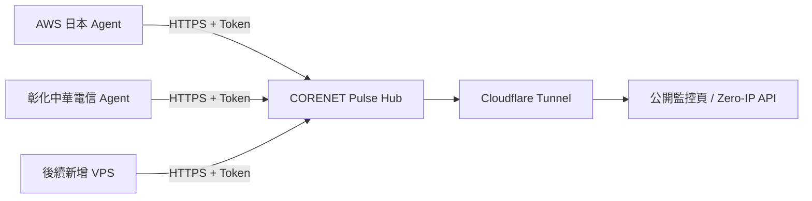

# CORENET PULSE

CORENET 自用、可持續擴充的 VPS／VDS 即時探針。第一版預設建立 **AWS 日本**與**彰化中華電信**兩個節點，之後可用腳本繼續加入新 VPS。


## 與參考專案的差異

本專案參考了 [monitor-theme-serverstatus](https://github.com/monitor-probe/monitor-theme-serverstatus) 的「快速掌握多節點狀態」方向，但程式、資料模型與介面均為獨立實作：

- 深墨綠＋電光綠的 CORENET NOC 介面，不沿用 ServerStatus 表格；
- 單一靜態 Go Hub 與單一靜態 Go Agent，無資料庫、無前端建置鏈；
- SSE 即時更新，WebSocket 被代理阻擋時也能穩定工作；
- CPU、記憶體、磁碟、上下行速率、累計流量、負載與連線數；
- 明確的公開資料 allow-list，從結構上排除 IP、hostname 與 token；
- Hub 預設只監聽 `127.0.0.1:9800`，適合搭配 Cloudflare Tunnel 隱藏源站。

## 架構



Agent 只主動向 Hub 回報；監控主機不需要開放 Agent 入站連接埠。Hub 不記錄來源 IP，也不將其寫入記憶體狀態或公開 JSON。

## 本機預覽

```bash
export AWS_JP_TOKEN='replace-with-at-least-20-characters'
export CHT_CHANGHUA_TOKEN='replace-with-at-least-20-characters'
export PULSE_CONFIG=configs/hub.example.json
go run ./cmd/hub
```

瀏覽 `http://127.0.0.1:9800`。未安裝 Agent 前兩個節點會顯示 `PENDING`，這是預期行為。

另一個終端可用本機暫代 AWS 日本做聯調：

```bash
PULSE_HUB_URL=http://127.0.0.1:9800 \
PULSE_NODE_ID=aws-jp-01 \
PULSE_NODE_TOKEN="$AWS_JP_TOKEN" \
go run ./cmd/agent
```

## 正式部署

### 1. 安裝 Hub

在 Hub 主機以 root 執行（一行完成；Token 會自動產生並只保存在主機）：

```bash
curl -fsSL https://raw.githubusercontent.com/souldance7-ai/VPS-/main/corenet-pulse/scripts/install-hub.sh | bash
```

安裝程式會優先下載 Release；若 Release 尚未建立，會自動安裝 Go 並從公開原始碼建置。重複執行會沿用既有 Token，不會讓已部署的 Agent 失效。

### 2. 建立公開 HTTPS 網址（Cloudflare Tunnel）

網域須已由您的 Cloudflare 帳號管理。把下方 `status.example.com` 換成自己的探針域名，在 Hub 主機以 root 執行：

```bash
curl -fsSL https://raw.githubusercontent.com/souldance7-ai/VPS-/main/corenet-pulse/scripts/install-tunnel.sh -o /tmp/corenet-pulse-tunnel.sh && \
  PULSE_HOSTNAME='status.example.com' bash /tmp/corenet-pulse-tunnel.sh
```

首次執行會顯示 Cloudflare 登入連結；在電腦瀏覽器開啟、選擇該網域並授權，終端便會自動繼續。腳本安裝官方套件、建立具名 Tunnel 與 CNAME、設定開機啟動，再檢查公開 HTTPS API。這一步需您登入自己的 Cloudflare 帳號，GitHub 授權不包含 Cloudflare。

Hub 保持監聽 `127.0.0.1:9800`。設定與 Tunnel 憑證存於 `/etc/corenet-pulse/tunnel/`；服務名稱是 `corenet-pulse-tunnel`，使用獨立設定，不覆寫其他 Tunnel 的服務或設定。遇到已有的衝突 DNS 記錄會停止，不強制覆蓋。請勿另外建立指向源站 IP 的探針 A／AAAA 記錄。

```bash
systemctl is-active corenet-pulse-tunnel
curl -fsS https://status.example.com/api/public/state
```

### 3. 安裝 AWS 日本 Agent

```bash
sudo env \
  PULSE_HUB_URL='https://status.example.com' \
  PULSE_NODE_ID='aws-jp-01' \
  PULSE_NODE_TOKEN="$AWS_JP_TOKEN" \
  bash scripts/install-agent.sh
```

### 4. 安裝彰化中華電信 Agent

```bash
sudo env \
  PULSE_HUB_URL='https://status.example.com' \
  PULSE_NODE_ID='cht-changhua-01' \
  PULSE_NODE_TOKEN="$CHT_CHANGHUA_TOKEN" \
  bash scripts/install-agent.sh
```

> 指令裡的 Hub URL 應是經 Tunnel／CDN 代理的域名，不能填源站 IP。

## 後續新增 VPS

在 Hub 上新增一個節點：

```bash
sudo python3 scripts/add-node.py \
  --id jp-gateway-02 \
  --name 'JP Gateway 02' \
  --region 'Tokyo · JP' \
  --country JP \
  --provider 'Private VDS' \
  --network 'Tokyo Premium'

sudo systemctl restart corenet-pulse-hub
```

腳本會先備份設定，再輸出一次性的 `PULSE_NODE_ID` 與 `PULSE_NODE_TOKEN`。把它們填到新主機的 Agent 安裝命令即可。Token 只存 Hub 與對應 Agent，不進 GitHub。

## 公開 API

`GET /api/public/state` 只回傳：

- 公開節點名稱、國家／地區、服務商、線路標籤；
- OS、核心數、容量與即時利用率；
- 即時／累計流量與短期圖表資料；
- 在線狀態與最後回報時間。

它不包含 `ip`、`hostname`、`token`、HTTP peer address。測試 `TestPublicStateNeverLeaksSecretsOrPeerIP` 會在每次 CI 阻止這些欄位意外回歸。

## 建置與測試

```bash
make test
make build
```

產物位於 `bin/`。推送 `pulse-v*` tag 後，GitHub Actions 會建立 amd64／arm64 的 Hub 與 Agent Release。

## 授權

[MIT](LICENSE)。參考專案僅作產品方向研究，未複製其原始碼或視覺資產。
