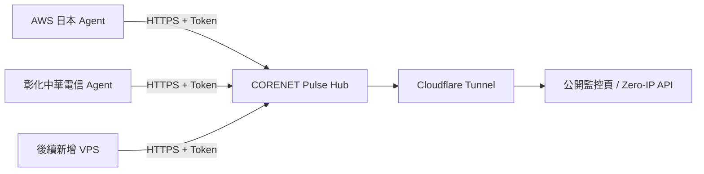

# CORENET PULSE

CORENET 自用、可持續擴充的 VPS／VDS 即時探針。第一版預設建立 **AWS 日本**與**彰化中華電信**兩個節點，之後可用腳本繼續加入新 VPS。


## 與參考專案的差異

本專案參考了 [monitor-theme-serverstatus](https://github.com/monitor-probe/monitor-theme-serverstatus) 的「快速掌握多節點狀態」方向，但程式、資料模型與介面均為獨立實作：

- 海洋藍、淺沙色與白色的海岸介面，放大繁體中文與即時數值；
- 卡片／列表切換、搜尋、狀態／地區／服務商篩選、排序與 12／24／50／100 筆分頁；
- 右上角動態顯示選單，支援海岸青、夜航藍、霓虹莓、夕照金四套色系，以及繁體中文、簡體中文、English 即時切換；
- 超過 12 個節點預設採用列表，可切回卡片並保存瀏覽偏好；
- 單一靜態 Go Hub 與單一靜態 Go Agent，無資料庫、無前端建置鏈；
- SSE 更新通知合併為每 3 秒至多一次快照請求；連線中斷時每 15 秒自動重試；
- CPU、記憶體、磁碟、上下行速率、累計流量、負載與連線數；
- 上海電信／聯通／移動 Ping 與丟包直接顯示，安徽三網放在詳情；管理頁可調整六條參考線路的目標；
- 明確的公開資料 allow-list，從結構上排除 IP、hostname 與 token；
- 獨立登入的 `/admin` 管理頁，自訂節點名稱、搜尋與恢復初始名稱，儲存後即時同步且重啟保留；
- Hub 預設只監聽 `127.0.0.1:9800`，適合搭配 Cloudflare Tunnel 隱藏源站。

## 架構



Agent 只主動向 Hub 回報；監控主機不需要開放 Agent 入站連接埠。Hub 不記錄來源 IP，也不將其寫入記憶體狀態或公開 JSON。

## 本機預覽

```bash
export AWS_JP_TOKEN='replace-with-at-least-20-characters'
export CHT_CHANGHUA_TOKEN='replace-with-at-least-20-characters'
export PULSE_CONFIG=configs/hub.example.json
go run ./cmd/hub
```

瀏覽 `http://127.0.0.1:9800`。未安裝 Agent 前兩個節點會顯示 `PENDING`，這是預期行為。

### 顯示設定與三語介面

公開頁面右上角的「顯示設定」採用帶過渡動畫的浮動選單。色系與語言切換均在瀏覽器本機完成，不會傳送到 Hub，也不會改動節點設定。選擇會存於瀏覽器 `localStorage`，下次開啟仍沿用；清除網站資料即可恢復預設的海岸青與繁體中文。

- 色系：海岸青、夜航藍、霓虹莓、夕照金；
- 語言：繁體中文、簡體中文、English；
- 無障礙：完整鍵盤焦點、`Escape` 收合選單，並遵循 `prefers-reduced-motion`；
- 響應式：桌面顯示文字按鈕，手機改為精簡圖示，支援 320 px 寬度。

另一個終端可用本機暫代 AWS 日本做聯調：

```bash
PULSE_HUB_URL=http://127.0.0.1:9800 \
PULSE_NODE_ID=aws-jp-01 \
PULSE_NODE_TOKEN="$AWS_JP_TOKEN" \
go run ./cmd/agent
```

## 正式部署

### 1. 安裝 Hub

在 Hub 主機以 root 執行（一行完成；Token 會自動產生並只保存在主機）：

```bash
curl -fsSL https://raw.githubusercontent.com/souldance7-ai/VPS-/main/corenet-pulse/scripts/install-hub.sh | bash
```

安裝程式會優先下載 Release；若 Release 尚未建立，會自動安裝 Go 並從公開原始碼建置。重複執行會沿用既有 Token，不會讓已部署的 Agent 失效。

### 2. 建立公開 HTTPS 網址（Cloudflare Tunnel）

網域須已由您的 Cloudflare 帳號管理。把下方 `status.example.com` 換成自己的探針域名，在 Hub 主機以 root 執行：

```bash
curl -fsSL https://raw.githubusercontent.com/souldance7-ai/VPS-/main/corenet-pulse/scripts/install-tunnel.sh -o /tmp/corenet-pulse-tunnel.sh && \
  PULSE_HOSTNAME='status.example.com' bash /tmp/corenet-pulse-tunnel.sh
```

首次執行會顯示 Cloudflare 登入連結；在電腦瀏覽器開啟、選擇該網域並授權，終端便會自動繼續。腳本安裝官方套件、建立具名 Tunnel 與 CNAME、設定開機啟動，再檢查公開 HTTPS API。這一步需您登入自己的 Cloudflare 帳號，GitHub 授權不包含 Cloudflare。

Hub 保持監聽 `127.0.0.1:9800`。設定與 Tunnel 憑證存於 `/etc/corenet-pulse/tunnel/`；服務名稱是 `corenet-pulse-tunnel`，使用獨立設定，不覆寫其他 Tunnel 的服務或設定。遇到已有的衝突 DNS 記錄會停止，不強制覆蓋。請勿另外建立指向源站 IP 的探針 A／AAAA 記錄。

```bash
systemctl is-active corenet-pulse-tunnel
curl -fsS https://status.example.com/api/public/state
```

### 3. 安裝 AWS 日本 Agent

建議先在 **Hub 主機** 一次產生兩個節點的完整安裝指令；將網址替換成自己的公開探針域名：

```bash
curl -fsSL https://raw.githubusercontent.com/souldance7-ai/VPS-/main/corenet-pulse/scripts/agent-commands.py -o /tmp/pulse-agent-commands.py && \
  python3 /tmp/pulse-agent-commands.py --hub-url https://status.example.com --node-id aws-jp-01 --node-id cht-changhua-01
```

它只讀取本機設定與 Token，不新增節點、不更換 Token，也不發送資料。輸出的兩段命令分別貼到對應的 AWS 日本、彰化中華電信主機以 root 執行。**輸出包含節點專用 Token，請勿貼到 GitHub 或公開頁面。**

Agent 安裝器支援 systemd 主機；需要時會從 Go 官方下載臨時建置工具並驗證 SHA-256，因此不依賴 Debian／Ubuntu 套件庫中的 Go 版本。服務啟動後，檢查公開頁面對應節點是否變成 ONLINE。

也可手動填入對應 Token 執行：

```bash
sudo env \
  PULSE_HUB_URL='https://status.example.com' \
  PULSE_NODE_ID='aws-jp-01' \
  PULSE_NODE_TOKEN="$AWS_JP_TOKEN" \
  bash scripts/install-agent.sh
```

### 4. 安裝彰化中華電信 Agent

```bash
sudo env \
  PULSE_HUB_URL='https://status.example.com' \
  PULSE_NODE_ID='cht-changhua-01' \
  PULSE_NODE_TOKEN="$CHT_CHANGHUA_TOKEN" \
  bash scripts/install-agent.sh
```

> 指令裡的 Hub URL 應是經 Tunnel／CDN 代理的域名，不能填源站 IP。

## 更新既有 Hub

在原本的 **Hub 主機** 以 root 執行（需要既有 Go 1.22+）：

```bash
curl -fsSL https://raw.githubusercontent.com/souldance7-ai/VPS-/main/corenet-pulse/scripts/update-hub.sh -o /tmp/pulse-update-hub.sh && \
  bash /tmp/pulse-update-hub.sh
```

腳本從原始碼建置最新版、備份目前程式、原子替換 Hub 並重啟；若健康檢查失敗會恢復上一版。沿用原有節點設定、Token 與 Cloudflare Tunnel。原 Agent 的資源回報可繼續使用；要新增三網 Ping，須依下方指令更新 Agent。Hub 重啟會清空記憶體中的短期圖表，各 Agent 會在下一次回報時重新顯示在線。完成後以 `Ctrl+F5` 重新整理網頁。

### 更新既有 Agent，啟用三網 Ping

**先更新 Hub，再到每台已安裝 Agent 的主機**以 root 執行：

```bash
curl -fsSL https://raw.githubusercontent.com/souldance7-ai/VPS-/main/corenet-pulse/scripts/update-agent.sh -o /tmp/pulse-update-agent.sh && \
  bash /tmp/pulse-update-agent.sh
```

更新器保留完整的 `/etc/corenet-pulse/agent.env`，不用重新輸入節點 ID 或 Token；下載並建置 Agent、安裝 `iputils-ping`／`iputils`、原子替換程式並檢查服務啟動，失敗會嘗試恢復先前程式與設定。部署指定版本時，請將下載網址中的 `main` 改為完整 commit SHA，同時設定 `PULSE_REF` 為該 SHA。`agent-commands.py --ref SHA` 會為新節點產生同版本的安裝指令。

### 上海主線、安徽輔線

- 列表及卡片顯示上海電信、聯通、移動的 RTT；展開詳情查看安徽三網。RTT 為最近一輪成功回應的平均值，提示文字列出最低／最高值及最後測試時間。
- 每台 Agent 的獨立工作每約 30 秒、每條啟用線路發送最多 3 個 16-byte payload 的 ICMP 封包。六條線路同時測試，單輪各有 7 秒上限；資源回報不等待 Ping，啟動與週期有隨機錯開。
- 丟包用最近 10 分鐘內、最多 20 輪／60 個封包計算，提示文字顯示實際送出與收到的數量。初次啟動／變更目標時由新樣本開始；不虛構尚未量測的歷史。
- `待更新 Agent`、`待測試`、`無回應`、`無法測試`、`資料過期`、`已停用` 分開顯示。缺少 ping 或沒有執行權限屬於無法測試；ICMP 被丟棄會無回應，不能據此宣稱 VPS 離線。超過 90 秒或節點離線的測試標為過期。
- 管理頁「三網探測」可調整／停用六個目標。設定存於 `/var/lib/corenet-pulse/probes.json`（0600）；同步到 Agent 約需 30 秒，設定版本不同的舊測量不會套用到新目標。
- 目標只接受公網 IP literal，排除 private、loopback、link-local、共享位址及特殊保留／過渡網段，避免 DNS 重綁定；Agent 也重新驗證。命令不使用 shell，不能自訂命令或增加任意探測數量。
- 預設為下表的區域參考目標，地域依 APNIC 網段登記核對，並非實體位置或 ICMP 可用性的保證。這些 RTT 是 **VPS → 參考目標 → VPS**，不等於上海／安徽任一使用者的接入體驗、頻寬或代理協議測速。若長期無回應，可換成同地區、同電信商且允許 ICMP 的自有測試目標。

| 地區 | 電信商 | 預設參考目標 | APNIC 登記 |
| --- | --- | --- | --- |
| 上海 | 電信 | `202.96.209.5` | [CHINANET-SH](https://rdap.apnic.net/ip/202.96.209.5) |
| 上海 | 聯通 | `210.22.70.3` | [CNCNET-SH](https://rdap.apnic.net/ip/210.22.70.3) |
| 上海 | 移動 | `211.136.112.50` | [CMNET-shanghai](https://rdap.apnic.net/ip/211.136.112.50) |
| 安徽 | 電信 | `61.132.163.68` | [CHINANET-AH](https://rdap.apnic.net/ip/61.132.163.68) |
| 安徽 | 聯通 | `218.104.78.2` | [合肥分配](https://rdap.apnic.net/ip/218.104.78.2)／[UNICOM-CN 上層網段](https://rdap.apnic.net/ip/218.104.0.0/14) |
| 安徽 | 移動 | `211.138.180.2` | [CMNET-anhui](https://rdap.apnic.net/ip/211.138.180.2) |

地址僅出現在私有設定、登入後的管理 API，以及帶節點專用 Bearer Token 的 `GET /api/v1/probes?node_id=...`。公開 API、HTML／JS 不含私有目標地址、來源 IP 或 Token；以上預設參考地址本身是公開資料。

### 50–100 個節點的瀏覽方式

- 列表直接顯示在線狀態、CPU、已用／總記憶體及磁碟、上下行速率、累計流量與運行時間。
- 累計流量是自系統啟動以來的網卡計數，不是月流量額度或帳單用量。
- CPU 型號、作業系統／核心、1／5／15 分鐘負載、連線數與處理程序可展開查看。
- 刷新保留搜尋、篩選、當前頁與已展開資料；只更新目前顯示的節點。
- 列表請求 `?history=0` 省略歷史點，卡片請求 `?history=30`；不因節點同時回報而重複下載快照。
- 資料取得失敗或超過 30 秒未更新時，頁面明確標記為最後收到的狀態。

## 後續新增 VPS

### 啟用節點名稱管理

先更新 Hub 到包含管理頁的版本，再於 Hub 主機以 root 執行：

```bash
curl -fsSL https://raw.githubusercontent.com/souldance7-ai/VPS-/main/corenet-pulse/scripts/setup-admin.sh -o /tmp/pulse-setup-admin.sh && \
  PULSE_HUB_URL=https://status.example.com bash /tmp/pulse-setup-admin.sh
```

腳本會產生專用管理密碼，顯示管理網址及密碼；再次執行沿用原密碼。前往 `https://status.example.com/admin` 登入，搜尋節點、輸入新的公開名稱，點選「儲存」。可隨時恢復初始名稱。節點 ID、Token、即時回報及歷史資料不因改名而改變，不用重裝 Agent。

- 管理密碼為隨機產生的 256-bit 金鑰；Hub 只載入它的 SHA-256 雜湊。明文密碼另存 `/etc/corenet-pulse/admin-login.txt`，權限 `0600`，只有 root 可讀。
- 登入使用 Secure、HttpOnly、SameSite=Strict 的 Cookie，8 小時到期；登出或 Hub 重啟後登入狀態失效。管理請求需來自所設定的 HTTPS 網址，登入嘗試有速率限制。
- 名稱覆寫獨立存於 `/var/lib/corenet-pulse/node-labels.json`，權限 `0600`；Hub 用 systemd `StateDirectory` 取得該資料目錄的寫入權限，`/etc/corenet-pulse` 繼續保持唯讀。
- 同一節點在其他視窗已被改名時會提示衝突，保留尚未儲存的輸入；名稱不可含 IP，管理 API 不回傳 Agent Token。
- 忘記管理密碼可由 root 讀取上述密碼檔。需要重新產生時，使用 `PULSE_RESET_ADMIN=1 PULSE_HUB_URL=https://status.example.com bash /tmp/pulse-setup-admin.sh`；自訂名稱與 Agent Token 保留。

批次更新並新增節點時，可一併加上 `PULSE_ENABLE_ADMIN=1`；更新工具會在最後啟用管理頁並顯示登入方式。自己的節點清單保存在 Hub，不必放入公開倉庫。

### 批次新增節點

以 `configs/fleet.example.json` 為格式範例，在 Hub 本機建立自己的 `/root/pulse-nodes.json`。清單只填網站上要顯示的名稱與地區標籤，不放入 IP、Token 或協議密碼。

在既有 Hub 更新介面並批次登錄這份清單：

```bash
curl -fsSL https://raw.githubusercontent.com/souldance7-ai/VPS-/main/corenet-pulse/scripts/update-fleet.sh -o /tmp/pulse-update-fleet.sh && \
  PULSE_HUB_URL=https://status.example.com PULSE_FLEET_FILE=/root/pulse-nodes.json bash /tmp/pulse-update-fleet.sh
```

替換成自己的公開域名與本機清單路徑。這個組合指令更新 Hub、為尚未登錄的 ID 產生獨立 Token，並輸出清單中各節點的 Agent 安裝指令。重複執行不重複新增，也不更換既有 Token。新增節點在 Agent 回報前顯示「待接入」，不產生示範數據。原本已接入的 Agent 不需重裝；本機清單不會上傳至 GitHub。

代理設定中的 `server` 可能是中轉入口，不能直接用來判定實際出口主機。請把對應 Agent 安裝在要監控的實際主機；協議的延遲測試不能取代主機資源回報。

自訂清單可用 `scripts/import-nodes.py --manifest my-nodes.json --restart` 匯入。JSON 的 `nodes` 陣列每筆接受 `id/name/region/country/provider/network/plan`；Token 一律由 Hub 產生。新增或批次匯入會保存設定原有的擁有者與讀取權限。

### 單獨新增節點

在 Hub 上新增一個節點：

```bash
sudo python3 scripts/add-node.py \
  --id jp-gateway-02 \
  --name 'JP Gateway 02' \
  --region 'Tokyo · JP' \
  --country JP \
  --provider 'Private VDS' \
  --network 'Tokyo Premium'

sudo systemctl restart corenet-pulse-hub
```

腳本會先備份設定，再輸出一次性的 `PULSE_NODE_ID` 與 `PULSE_NODE_TOKEN`。把它們填到新主機的 Agent 安裝命令即可。Token 只存 Hub 與對應 Agent，不進 GitHub。

## 公開 API

`GET /api/public/state` 只回傳：

- 公開節點名稱、國家／地區、服務商、線路標籤；
- OS、核心數、容量與即時利用率；
- 即時／累計流量與短期圖表資料；
- 在線狀態與最後回報時間。
- 六條三網參考線路的固定地區／電信商名稱、測試狀態、RTT、丟包樣本數與最後測試時間。

它不包含 `ip`、`hostname`、`token`、HTTP peer address。測試 `TestPublicStateNeverLeaksSecretsOrPeerIP` 會在每次 CI 阻止這些欄位意外回歸。

## 建置與測試

```bash
make test
make build
```

產物位於 `bin/`。推送 `pulse-v*` tag 後，GitHub Actions 會建立 amd64／arm64 的 Hub 與 Agent Release。

## 授權

[MIT](LICENSE)。參考專案僅作產品方向研究，未複製其原始碼或視覺資產。
